# CodePatchBay 系统维度化流程

本文从不同维度拆解 CodePatchBay 的运行流程。这里的“维度”不是目录层级，而是观察系统的切面：同一个任务会同时穿过入口、队列、编排、worker、核心引擎、ACP、状态、审查、发布等多条流程。

配套阅读：

- `docs/architecture/runtime-boundaries.md`：层边界和允许依赖方向。
- `docs/architecture/unit-flowcharts.md`：按单元展开的流程图。

## 0. 总控地图

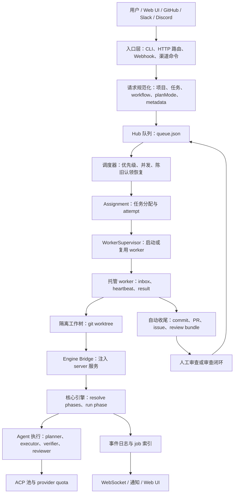

这张图表达的是主链路：

1. 入口层把外部请求转成统一任务描述。
2. 任务进入 Hub 队列，队列只表达“要做什么”和元数据，不直接执行。
3. Hub 编排器持有 leader lock，按优先级和并发限制调度。
4. Worker 在隔离 worktree 中运行核心引擎。
5. 核心引擎按 workflow 运行阶段，每个阶段通过 ACP 池调用 agent。
6. 状态、事件、产物、审查结论回写到 runtime root，供 UI、CLI、审查和恢复流程读取。

## 1. 分层边界维度

这一维度回答：代码应该放在哪里、依赖应该往哪个方向走。

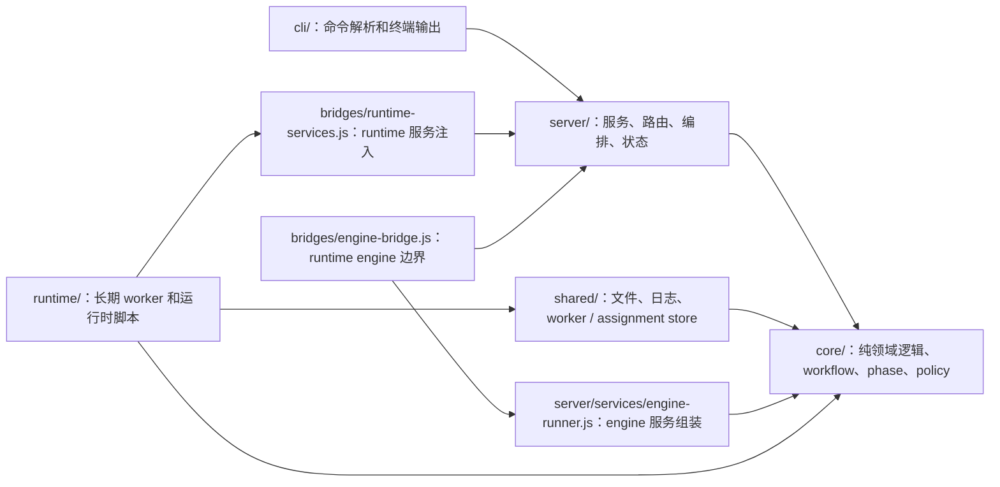

关键规则：

- `core/` 只放纯逻辑，不直接导入 `server/`、`runtime/`、`cli/` 或 `bridges/`。
- `server/` 可以使用 `core/`，但不直接导入 `runtime/` 实现。
- `cli/` 只负责命令参数、输出和路由；服务能力直接进入 canonical `server/` 模块。
- `runtime/` 可以运行长期进程，使用 canonical runtime 入口；不得直接导入 `server/`。
- `bridges/` 是允许跨层装配的位置，用于明确的边界入口和服务注入；后续不新增兼容入口或薄 re-export。
- `shared/` 承载无副作用共享基础设施，避免 runtime 为了 store / logger / fs helper 穿到 server。

硬切原则：

- 不保留旧路径兼容入口。
- 不新增兼容 re-export。
- 不维护同一能力的新旧双轨调用。
- 迁移完成后，旧入口应删除或改为明确失败。

边界测试：

- `tests/core-boundary.test.mjs`
- `tests/server-boundary.test.mjs`
- `tests/runtime-boundary.test.mjs`
- `tests/cli-boundary.test.mjs`

## 2. 入口维度

这一维度回答：任务从哪里进入系统。

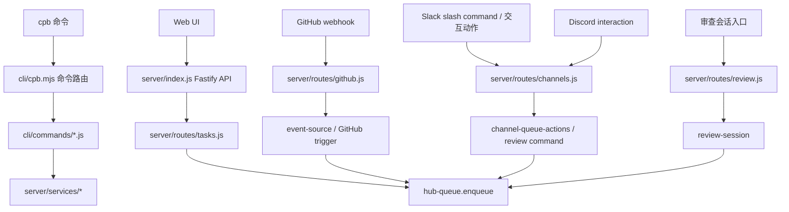

入口类型：

| 入口 | 主要文件 | 转换结果 |
| --- | --- | --- |
| CLI | `cli/cpb.mjs`、`cli/commands/*.js` | 直接调用 bridge service 或写入 Hub 队列 |
| Web API | `server/index.js`、`server/routes/tasks.js` | 校验项目和 ACP lane 后入队 |
| GitHub webhook | `server/routes/github.js` | 验签、归一化事件、匹配 trigger、入队或处理 approve |
| Slack / Discord | `server/routes/channels.js` | 验签、解析命令、执行 channel policy、入队或更新审查 |
| 审查会话 | `server/routes/review.js` | 创建 session、启动 research、approve 后入队 |

入口层不应该直接决定如何执行任务。它只负责把请求转成统一的队列项或服务动作。

## 3. 请求规范化维度

这一维度回答：外部请求如何变成稳定的任务元数据。

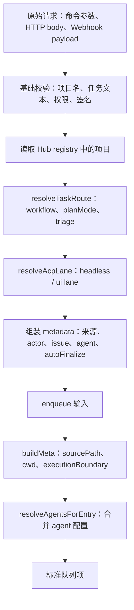

标准队列项核心字段：

- `id`：队列项 id。
- `projectId`：项目 id。
- `sourcePath`：项目源码路径。
- `description`：任务描述。
- `priority`：默认 `P2`。
- `status`：初始为 `pending`。
- `metadata.workflow`：默认或自动路由后的 workflow。
- `metadata.planMode`：默认或自动路由后的 plan mode。
- `metadata.acpProfile`：默认 `headless`。
- `metadata.autoFinalize`：成功后是否自动收尾。
- `metadata.sourceContext`：GitHub、渠道、审查、修正循环等上下文。

## 4. 队列维度

这一维度回答：任务如何排队、去重、更新状态。

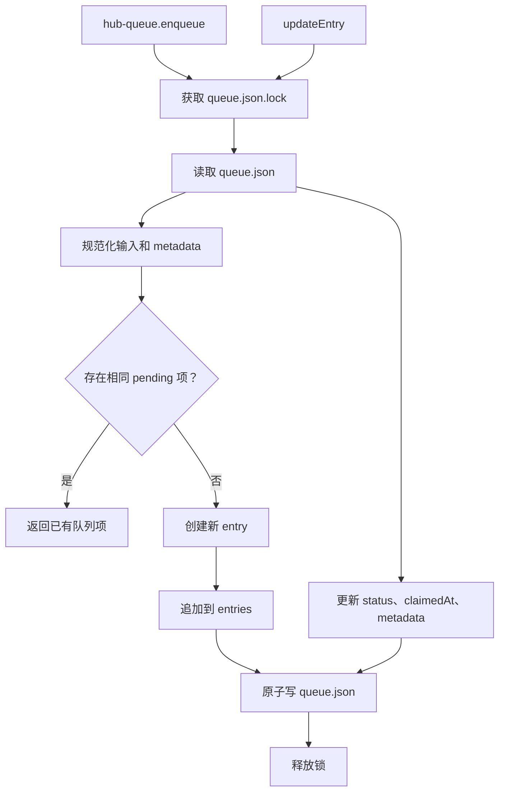

状态流：

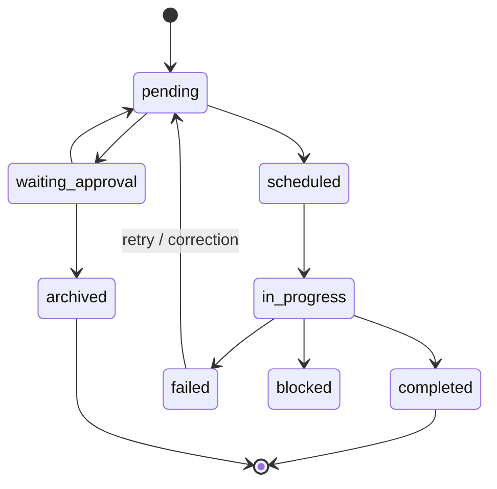

队列维度的关键约束：

- 写队列必须走锁，避免多个入口同时修改 `queue.json`。
- 调度器会处理陈旧的 `scheduled` / `in_progress` 队列项，但必须先确认 assignment 是否仍活跃。
- 队列只表达候选任务，不持有 worker 进程生命周期。

## 5. 编排与调度维度

这一维度回答：谁来决定下一步执行哪个任务。

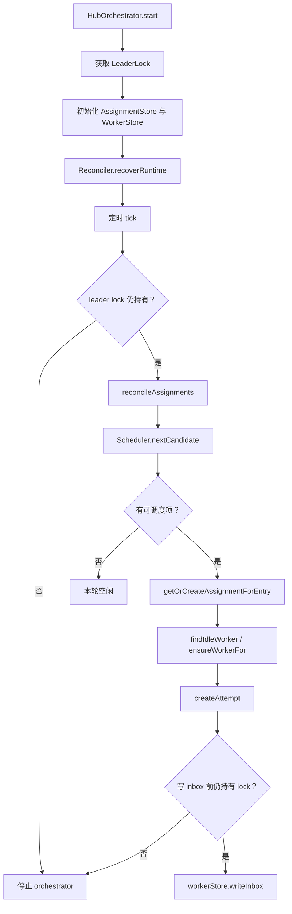

调度决策顺序：

1. 检查 leader lock，保证只有一个 orchestrator 写入调度结果。
2. reconcile 已存在 assignment，把完成、失败、卡住的 attempt 收口。
3. 读取队列，恢复陈旧 claim。
4. 应用 Hub 和项目并发限制。
5. 按 priority 和 createdAt 选择候选项。
6. 创建 assignment 和 attempt。
7. 启动或复用 worker。
8. 写入 worker inbox，交给 worker 被动执行。

## 6. Worker 执行维度

这一维度回答：任务如何在隔离环境里真正运行。

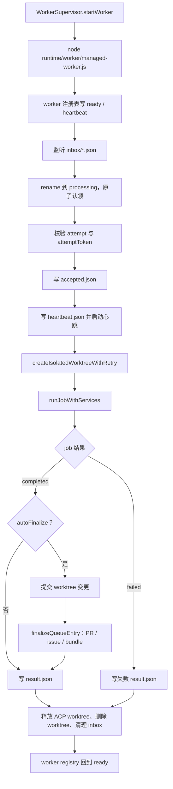

Worker 的几个职责边界：

- Worker 不主动从队列抢任务，只处理 orchestrator 写入的 inbox。
- Worker 必须在隔离 worktree 执行，不允许回退到源码 checkout。
- Worker 通过 `bridges/engine-bridge.js` 进入 `server/services/engine-runner.js`，不直接拼接 server 服务。
- Worker 写 `accepted.json`、`heartbeat.json`、`result.json`，reconciler 据此推进 assignment。

## 7. 核心引擎维度

这一维度回答：一个 job 内部如何按阶段执行。

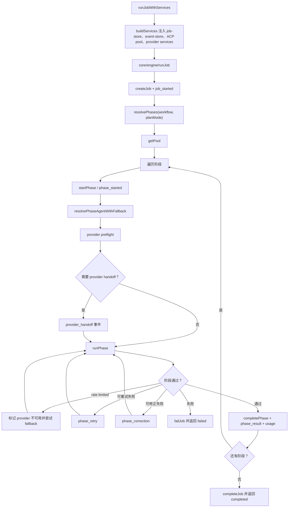

核心引擎负责：

- 建 job。
- 解析 workflow 阶段。
- 根据 phase / role / routing 选择 agent。
- 执行 provider preflight 和中途 quota fallback。
- 运行 phase adapter。
- 处理重试、修正和失败终止。
- 追加事件和 provider usage。

核心引擎不应该负责：

- 队列文件格式。
- HTTP / CLI 输出。
- Hub registry。
- ACP 池的持久化实现。
- GitHub PR 创建。

这些能力通过 `server/services/engine-runner.js` 注入；runtime 侧只通过 `bridges/engine-bridge.js` 进入该边界。

## 8. ACP 与 provider 配额维度

这一维度回答：agent 调用如何被限流、复用和审计。

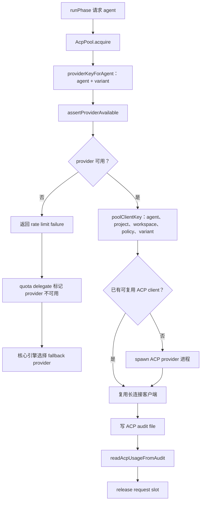

配额维度的状态来源：

- `server/services/acp-pool.js`：ACP 客户端池、并发、provider key、audit usage。
- `server/services/provider-quota.js`：provider 可用性、rate limit 分类。
- `server/services/provider-adapters.js`：provider key 到 adapter 的映射。
- `server/services/quota-delegate.js` / `quota-delegate-client.js`：跨进程写 provider 状态和 usage 队列。

常见失败点：

- provider 被判定不可用：阶段尝试 fallback。
- 所有 fallback 不可用：写 `provider_quota_blocked`。
- delegate 写失败：核心引擎转为结构化 runtime failure。
- ACP 池等待超时：worker 写 pool exhausted 失败结果。

## 9. 状态与产物维度

这一维度回答：系统状态落在哪里、如何被读回。

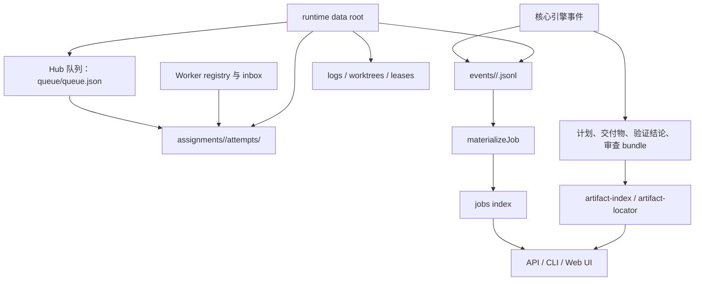

主要状态文件：

| 状态 | 位置 | 用途 |
| --- | --- | --- |
| Hub 队列 | `<hubRoot>/queue/queue.json` | 待执行、已调度、待审批任务 |
| Assignment | `<hubRoot>/assignments/...` | worker attempt、accepted、heartbeat、result |
| Worker 注册表 | `<hubRoot>/workers/registry/*.json` | worker pid、状态、心跳 |
| Worker inbox | `<hubRoot>/workers/inbox/<workerId>/*.json` | orchestrator 到 worker 的任务投递 |
| Job 事件 | `<runtimeRoot>/events/<project>/<jobId>.jsonl` | job 状态事实来源 |
| Job 索引 | runtime root 中的索引文件 | 快速列表与 UI 查询 |
| Worktree | `<hubRoot>/worktrees/...` | 临时隔离执行目录 |
| 审查会话 | review session 存储 | 用户审查、research、approve/reject |

事件日志规则：

- 事件是 append-only。
- `event-store` 会锁文件、防止尾部损坏、阻止 terminal job 被继续写业务事件。
- 事件内容会经过 secret redaction。
- `materializeJob` 把事件流还原成当前 job 状态。

## 10. 审查闭环维度

这一维度回答：人工审查、拒绝和修正如何回到主流程。

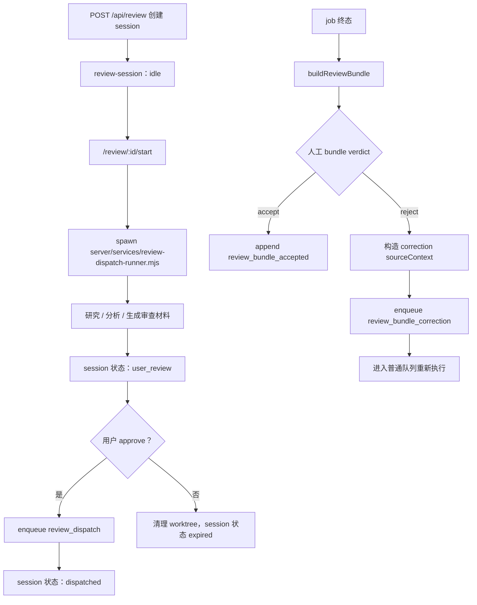

审查有两条线：

1. `review session`：用于先研究、再由用户 approve 后派发流水线。
2. `review bundle loop`：用于 job 终态后的接受/拒绝；拒绝会生成修正队列项。

拒绝修正会携带：

- 原 job id。
- 原 bundle id。
- 用户反馈。
- 上一轮计划、交付物、verdict、diff 片段。
- `reviewRound`。
- `correctionQueueEntryId`。

这使下一轮执行能看到“为什么被拒绝”和“要修什么”。

## 11. 外部渠道维度

这一维度回答：GitHub、Slack、Discord 如何进入同一队列。

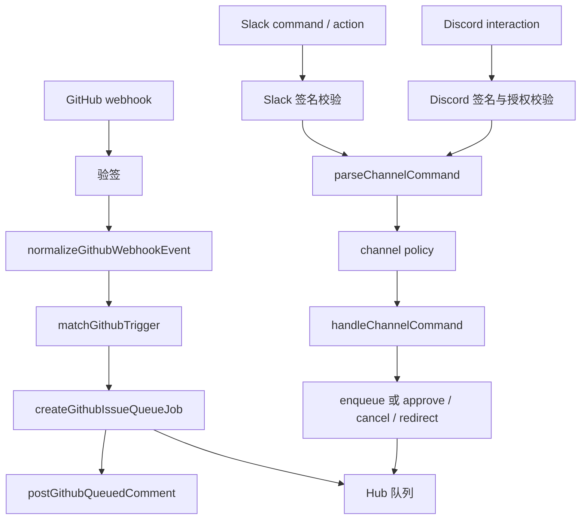

渠道层的共同流程：

1. 先验证来源真实性。
2. 把平台 payload 归一化为内部命令或事件。
3. 做项目绑定和权限策略判断。
4. 创建或更新队列项。
5. 必要时回写平台评论或交互响应。

渠道层不直接运行 agent，也不直接改 worktree。

## 12. 运行根与数据隔离维度

这一维度回答：多项目、多 release、多 runtime root 如何分离。

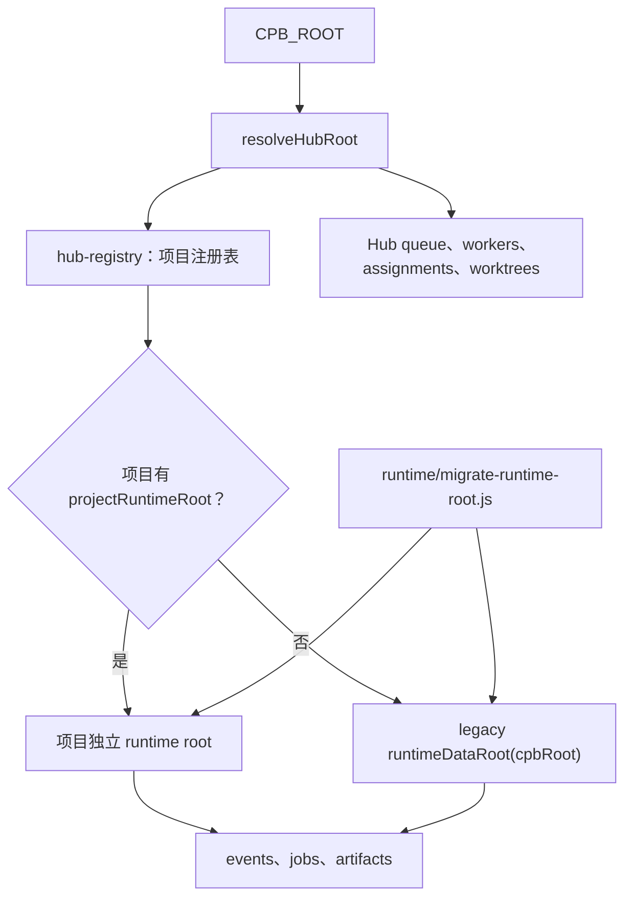

关键原则：

- Hub 级状态放在 `hubRoot`：队列、worker、assignment、worktree、日志。
- 项目 job 事件优先放在项目自己的 `projectRuntimeRoot`。
- 当前仍有 legacy `runtimeDataRoot(cpbRoot)` 回退路径；这是迁移期残留，后续应硬切到项目 runtime root。
- 迁移脚本负责把旧 `.omc` / `cpb-task` / `wiki/projects` 数据迁到新的 runtime roots。

## 13. 安装与发布维度

这一维度回答：当前源码、安装 release、executor root 如何被选择和校验。

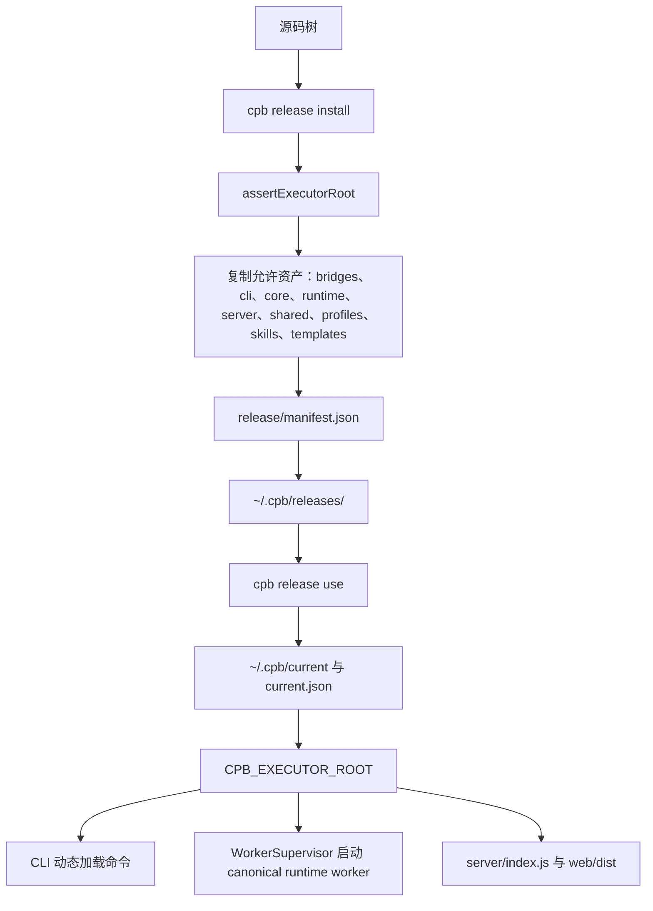

发布维度的关键文件：

- `package.json`：npm 包白名单。
- `server/services/release-store.js`：release 安装、选择、格式校验。
- `server/services/executor-root.js`：executor root 必需文件校验。
- `cli/commands/release-select.js`：用户命令入口。

发布风险点：

- 新增 bridge、shared 或 server service 文件必须被 git 跟踪并进入包。
- `REQUIRED_EXECUTOR_FILES` 需要覆盖真实运行入口及其关键依赖。
- release manifest 的 state format version 要和当前 reader 保持一致；不维护多版本兼容分支。

## 14. 恢复与观测维度

这一维度回答：系统如何发现卡住、失败、陈旧和污染。

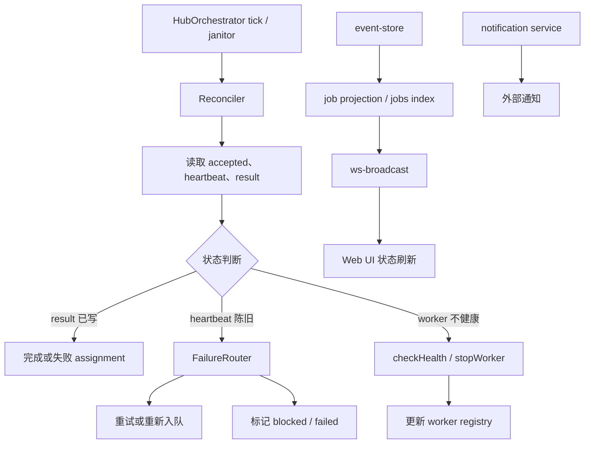

恢复依据：

- queue 状态与 claimedAt。
- assignment 状态。
- attempt 的 `accepted.json`、`heartbeat.json`、`result.json`。
- worker registry 的 pid、状态和心跳时间。
- job 事件是否已经 terminal。
- provider quota 和 ACP pool 状态。

恢复策略：

- 队列项陈旧但 assignment 活跃：刷新 claimedAt，不重置。
- 队列项陈旧且无活跃 assignment：重置为 pending。
- worker 心跳陈旧：标记 unhealthy 或停止进程组。
- attempt 有 result：reconciler 收口 assignment。
- 可修正失败：由 review loop 或 retry 生成下一轮队列项。

## 15. 安全与权限维度

这一维度回答：哪些地方负责防止越权、泄露和不安全写入。

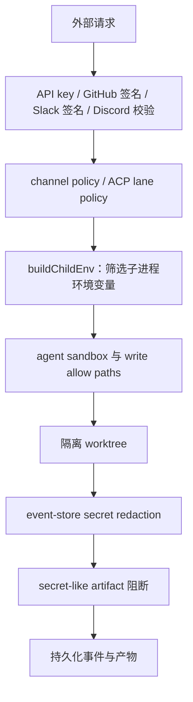

安全边界：

- 外部入口先做身份和签名校验。
- 渠道动作走 `channel-policy`。
- UI lane 需要显式 reason。
- 子进程环境通过 `secret-policy` / `child-env` 控制。
- agent 写入范围由 ACP policy 和 sandbox 控制。
- 事件落盘前做 secret redaction 和 secret-like artifact 拦截。

## 16. 从维度看耦合热点

当前拆分后，严重耦合已经从 `core/runtime/cli/server` 的互相穿层下降到少数装配点。后续判断风险时，可以按下面顺序看：

| 风险位置 | 为什么敏感 | 建议看什么 |
| --- | --- | --- |
| `server/services/engine-runner.js` | 负责把 server 能力注入 core，注入契约错了会影响所有 job | providerServices 合并、默认服务、测试覆盖 |
| `bridges/engine-bridge.js` | runtime-facing engine 边界，runtime 通过它进入 server-owned runner | 是否只服务 runtime、是否避免 server 反向依赖 bridges |
| `bridges/runtime-services.js` | 负责把 server 协作者注入 runtime，扩大后会重新形成隐性控制面 | 是否只服务 runtime、是否替代直连 server、是否没有旧路径兼容 |
| `shared/orchestrator/*` | runtime 和 server 都会读写 assignment / worker store | 是否保持无 HTTP / CLI 副作用、状态格式是否稳定 |
| `server/services/executor-root.js` | release / worker / CLI 都依赖 executor root 校验 | 必需文件是否覆盖传递入口 |
| `runtime/evolve/multi-evolve.js` | 长期编排脚本和 worker 入口相连 | 保持只启动 canonical `runtime/worker/managed-worker.js`，不要恢复旧入口 |
| `server/services/acp-pool.js` | ACP 连接、provider、quota、audit 都集中在这里 | provider key、连接释放、usage 统计 |
| 边界测试 | 防止未来重新穿层 | 副作用 import、动态路径、new URL、模板字符串 |

## 17. 读图路线

排查问题时建议按问题类型选维度：

- 任务没有开始：看入口维度、队列维度、编排与调度维度。
- 任务开始但没有产物：看 worker 执行维度、核心引擎维度、ACP 与 provider 维度。
- UI 状态不对：看状态与产物维度、恢复与观测维度。
- 审查拒绝后没有重跑：看审查闭环维度、队列维度。
- GitHub / Slack / Discord 没触发：看外部渠道维度、安全与权限维度。
- 安装包或 release 跑不起来：看安装与发布维度、分层边界维度。
- 怀疑重新耦合：看分层边界维度和边界测试。
