# CodePatchBay 各单元流程图

> ⚠️ **本文档部分章节已过时（2026-06-13 标注）**
>
> CodePatchBay 已移除 HTTP server / Fastify / React 前端（`server/index.js`、
> `server/routes/*`、`web/`）以及 `cli/cpb.mjs` 入口。当前是**纯 Node.js CLI**
> （入口 `cli/cpb.ts`，运行时依赖仅 `chokidar`），唯一的可选 HTTP 是
> `cpb stream`（Node 原生 SSE）。
>
> **下列章节描述的全栈架构已不存在，仅作历史参考：**
> - 「Server / API 单元」（服务启动、任务 API、事件/渠道流）
> - 「网页界面单元」（App 启动、仪表盘、审查页等）
> - 「服务类命令」中涉及 `cpb ui` / `server/index.js` / Fastify 的部分
>
> **仍然准确的章节**（核心编排流程未变）：端到端任务生命周期、`runJob` 状态机、
> 阶段适配器流程、Hub 编排器循环、Worker 生命周期、ACP/工作树/沙箱边界。
>
> 现状权威文档：[CLAUDE.md](../../CLAUDE.md)、[runtime-boundaries.md](runtime-boundaries.md)。

本文档用 Mermaid 流程图梳理 CodePatchBay 的主要单元，是
`runtime-boundaries.md` 的中文架构补充材料。

## 单元总览

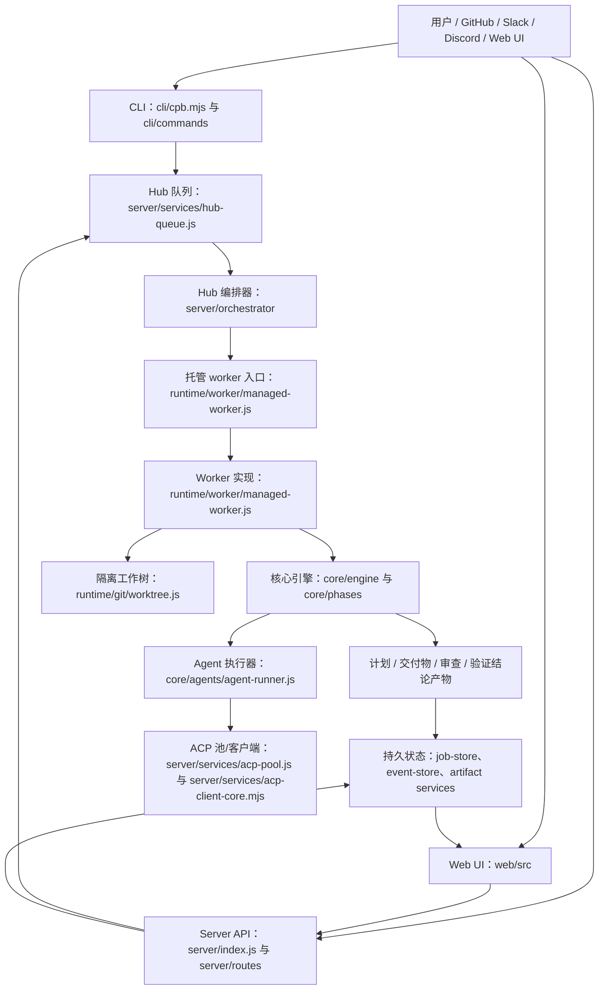
```mermaid
flowchart TD
  User["用户 / GitHub / Slack / Discord / Web UI"] --> CLI["CLI：cli/cpb.mjs 与 cli/commands"]
  User --> Web["Web UI：web/src"]
  User --> Api["Server API：server/index.js 与 server/routes"]

  CLI --> Queue["Hub 队列：server/services/hub-queue.js"]
  Web --> Api
  Api --> Queue
  Api --> State["持久状态：job-store、event-store、artifact services"]

  Queue --> Orch["Hub 编排器：server/orchestrator"]
  Orch --> Worker["托管 worker 入口：runtime/worker/managed-worker.js"]
  Worker --> WorkerImpl["Worker 实现：runtime/worker/managed-worker.js"]
  WorkerImpl --> Core["核心引擎：core/engine 与 core/phases"]
  Core --> AgentRunner["Agent 执行器：core/agents/agent-runner.js"]
  AgentRunner --> Acp["ACP 池/客户端：server/services/acp-pool.js 与 server/services/acp-client-core.mjs"]
  WorkerImpl --> Worktree["隔离工作树：runtime/git/worktree.js"]
  Core --> Artifacts["计划 / 交付物 / 审查 / 验证结论产物"]
  Artifacts --> State
  State --> Web
```

主要依据文件：

- `README.md`
- `cli/cpb.mjs`
- `server/index.js`
- `core/engine/run-job.js`
- `server/orchestrator/hub-orchestrator.js`
- `runtime/worker/managed-worker.js`
- `runtime/worker/managed-worker.js`
- `web/src/App.tsx`
- `docs/architecture/runtime-boundaries.md`

## 端到端任务生命周期

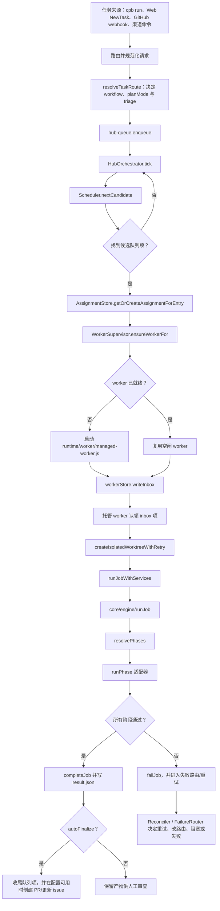
```mermaid
flowchart TD
  A["任务来源：cpb run、Web NewTask、GitHub webhook、渠道命令"] --> B["路由并规范化请求"]
  B --> C["resolveTaskRoute：决定 workflow、planMode 与 triage"]
  C --> D["hub-queue.enqueue"]
  D --> E["HubOrchestrator.tick"]
  E --> F["Scheduler.nextCandidate"]
  F --> G{"找到候选队列项？"}
  G -->|"否"| E
  G -->|"是"| H["AssignmentStore.getOrCreateAssignmentForEntry"]
  H --> I["WorkerSupervisor.ensureWorkerFor"]
  I --> J{"worker 已就绪？"}
  J -->|"否"| K["启动 runtime/worker/managed-worker.js"]
  J -->|"是"| L["复用空闲 worker"]
  K --> M["workerStore.writeInbox"]
  L --> M
  M --> N["托管 worker 认领 inbox 项"]
  N --> O["createIsolatedWorktreeWithRetry"]
  O --> P["runJobWithServices"]
  P --> Q["core/engine/runJob"]
  Q --> R["resolvePhases"]
  R --> S["runPhase 适配器"]
  S --> T{"所有阶段通过？"}
  T -->|"是"| U["completeJob 并写 result.json"]
  T -->|"否"| V["failJob，并进入失败路由/重试"]
  U --> W{"autoFinalize？"}
  W -->|"是"| X["收尾队列项，并在配置可用时创建 PR/更新 issue"]
  W -->|"否"| Y["保留产物供人工审查"]
  V --> Z["Reconciler / FailureRouter 决定重试、改路由、阻塞或失败"]
```

主要依据文件：

- `cli/commands/run.js`
- `cli/commands/pipeline.js`
- `server/routes/tasks.js`
- `server/routes/github.js`
- `server/routes/channels.js`
- `server/services/hub-queue.js`
- `server/orchestrator/hub-orchestrator.js`
- `runtime/worker/managed-worker.js`
- `server/services/engine-runner.js`
- `bridges/engine-bridge.js`
- `core/engine/run-job.js`

## CLI 单元

### CLI 入口与命令路由

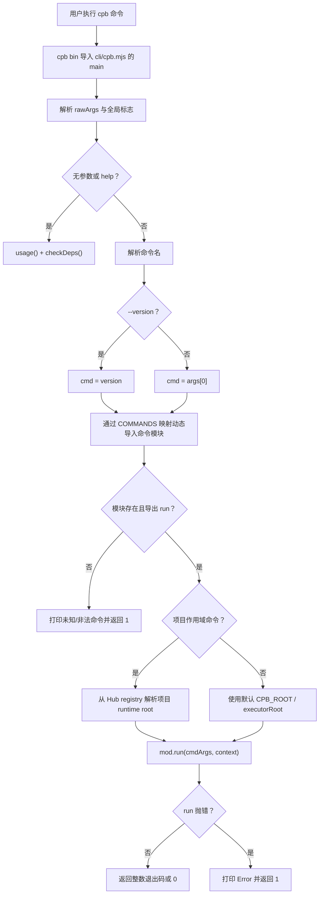
```mermaid
flowchart TD
  A["用户执行 cpb 命令"] --> B["cpb bin 导入 cli/cpb.mjs 的 main"]
  B --> C["解析 rawArgs 与全局标志"]
  C --> D{"无参数或 help？"}
  D -->|"是"| E["usage() + checkDeps()"]
  D -->|"否"| F["解析命令名"]
  F --> G{"--version？"}
  G -->|"是"| H["cmd = version"]
  G -->|"否"| I["cmd = args[0]"]
  H --> J["通过 COMMANDS 映射动态导入命令模块"]
  I --> J
  J --> K{"模块存在且导出 run？"}
  K -->|"否"| L["打印未知/非法命令并返回 1"]
  K -->|"是"| M{"项目作用域命令？"}
  M -->|"是"| N["从 Hub registry 解析项目 runtime root"]
  M -->|"否"| O["使用默认 CPB_ROOT / executorRoot"]
  N --> P["mod.run(cmdArgs, context)"]
  O --> P
  P --> Q{"run 抛错？"}
  Q -->|"否"| R["返回整数退出码或 0"]
  Q -->|"是"| S["打印 Error 并返回 1"]
```

主要依据文件：

- `cpb`
- `cli/cpb.mjs`
- `cli/commands/*.js`

### `cpb run` / `cpb pipeline`

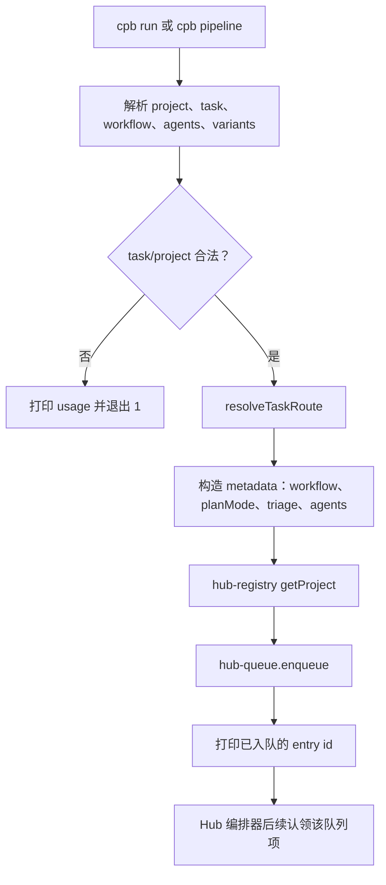
```mermaid
flowchart TD
  A["cpb run 或 cpb pipeline"] --> B["解析 project、task、workflow、agents、variants"]
  B --> C{"task/project 合法？"}
  C -->|"否"| D["打印 usage 并退出 1"]
  C -->|"是"| E["resolveTaskRoute"]
  E --> F["构造 metadata：workflow、planMode、triage、agents"]
  F --> G["hub-registry getProject"]
  G --> H["hub-queue.enqueue"]
  H --> I["打印已入队的 entry id"]
  I --> J["Hub 编排器后续认领该队列项"]
```

主要依据文件：

- `cli/commands/run.js`
- `cli/commands/pipeline.js`
- `core/workflow/auto-route.js`
- `server/services/hub-registry.js`
- `server/services/hub-queue.js`

### 服务类命令

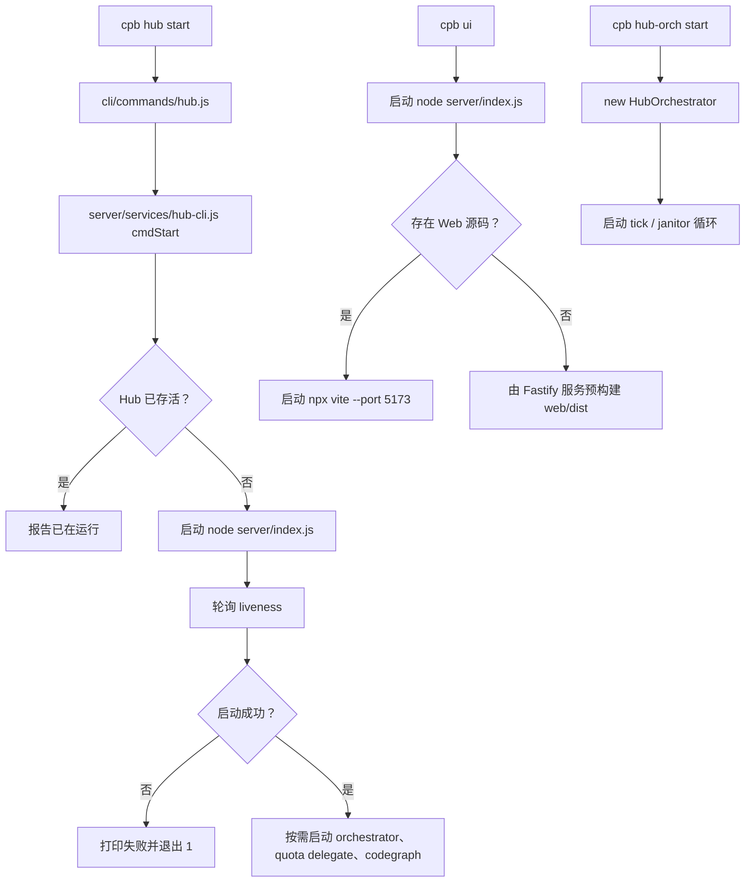
```mermaid
flowchart TD
  A["cpb hub start"] --> B["cli/commands/hub.js"]
  B --> C["server/services/hub-cli.js cmdStart"]
  C --> D{"Hub 已存活？"}
  D -->|"是"| E["报告已在运行"]
  D -->|"否"| F["启动 node server/index.js"]
  F --> G["轮询 liveness"]
  G --> H{"启动成功？"}
  H -->|"否"| I["打印失败并退出 1"]
  H -->|"是"| J["按需启动 orchestrator、quota delegate、codegraph"]

  K["cpb ui"] --> L["启动 node server/index.js"]
  L --> M{"存在 Web 源码？"}
  M -->|"是"| N["启动 npx vite --port 5173"]
  M -->|"否"| O["由 Fastify 服务预构建 web/dist"]

  P["cpb hub-orch start"] --> Q["new HubOrchestrator"]
  Q --> R["启动 tick / janitor 循环"]
```

主要依据文件：

- `cli/commands/hub.js`
- `server/services/hub-cli.js`
- `cli/commands/ui.js`
- `cli/commands/hub-orch.js`
- `server/index.js`
- `server/orchestrator/hub-orchestrator.js`

## Server / API 单元

### 服务启动流程

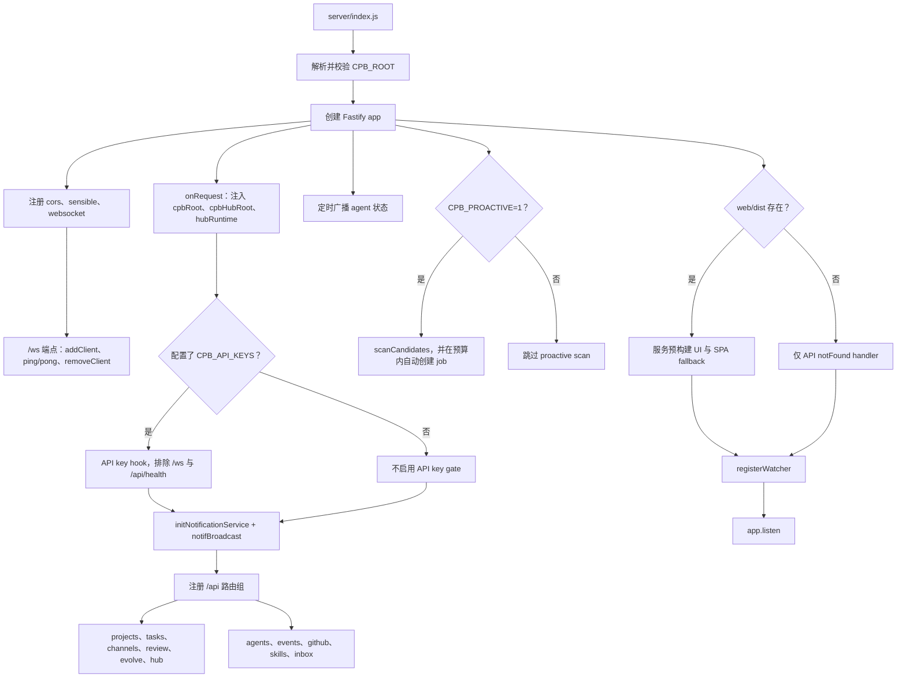
```mermaid
flowchart TD
  A["server/index.js"] --> B["解析并校验 CPB_ROOT"]
  B --> C["创建 Fastify app"]
  C --> D["注册 cors、sensible、websocket"]
  D --> E["/ws 端点：addClient、ping/pong、removeClient"]
  C --> F["onRequest：注入 cpbRoot、cpbHubRoot、hubRuntime"]
  F --> G{"配置了 CPB_API_KEYS？"}
  G -->|"是"| H["API key hook，排除 /ws 与 /api/health"]
  G -->|"否"| I["不启用 API key gate"]
  H --> J["initNotificationService + notifBroadcast"]
  I --> J
  J --> K["注册 /api 路由组"]
  K --> L["projects、tasks、channels、review、evolve、hub"]
  K --> M["agents、events、github、skills、inbox"]
  C --> N["定时广播 agent 状态"]
  C --> O{"CPB_PROACTIVE=1？"}
  O -->|"是"| P["scanCandidates，并在预算内自动创建 job"]
  O -->|"否"| Q["跳过 proactive scan"]
  C --> R{"web/dist 存在？"}
  R -->|"是"| S["服务预构建 UI 与 SPA fallback"]
  R -->|"否"| T["仅 API notFound handler"]
  S --> U["registerWatcher"]
  T --> U
  U --> V["app.listen"]
```

主要依据文件：

- `server/index.js`
- `server/services/ws-broadcast.js`
- `server/services/notification/index.js`
- `server/services/watcher.js`

### 任务 API 与审查动作

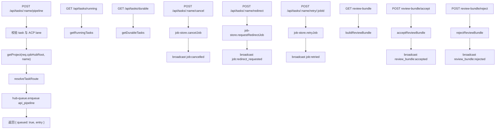
```mermaid
flowchart TD
  A["POST /api/tasks/:name/pipeline"] --> B["校验 task 与 ACP lane"]
  B --> C["getProject(req.cpbHubRoot, name)"]
  C --> D["resolveTaskRoute"]
  D --> E["hub-queue.enqueue api_pipeline"]
  E --> F["返回 { queued: true, entry }"]

  G["GET /api/tasks/running"] --> H["getRunningTasks"]
  I["GET /api/tasks/durable"] --> J["getDurableTasks"]
  K["POST /api/tasks/:name/cancel"] --> L["job-store.cancelJob"]
  M["POST /api/tasks/:name/redirect"] --> N["job-store.requestRedirectJob"]
  O["POST /api/tasks/:name/retry/:jobId"] --> P["job-store.retryJob"]

  Q["GET review-bundle"] --> R["buildReviewBundle"]
  S["POST review-bundle/accept"] --> T["acceptReviewBundle"]
  U["POST review-bundle/reject"] --> V["rejectReviewBundle"]

  L --> W["broadcast job:cancelled"]
  N --> X["broadcast job:redirect_requested"]
  P --> Y["broadcast job:retried"]
  T --> Z["broadcast review_bundle:accepted"]
  V --> AA["broadcast review_bundle:rejected"]
```

主要依据文件：

- `server/routes/tasks.js`
- `core/acp/policy.js`
- `core/workflow/auto-route.js`
- `server/services/hub-queue.js`
- `server/services/job-store.js`
- `server/services/review-bundle.js`
- `server/services/review-loop.js`

### 事件、GitHub、渠道与产物流

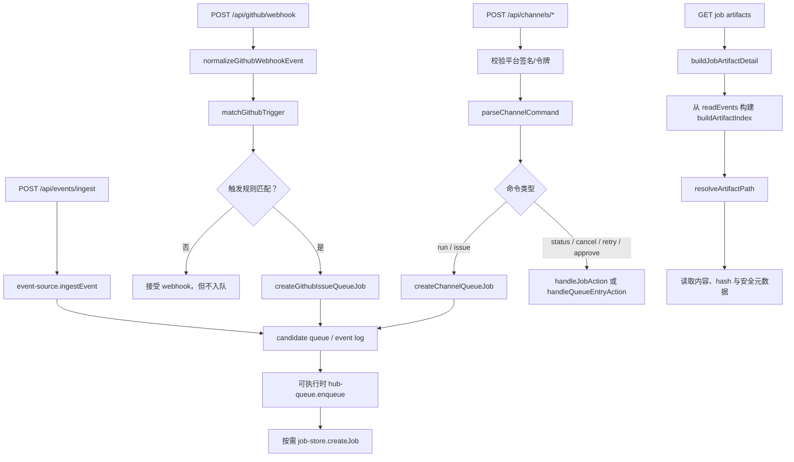
```mermaid
flowchart TD
  A["POST /api/events/ingest"] --> B["event-source.ingestEvent"]
  C["POST /api/github/webhook"] --> D["normalizeGithubWebhookEvent"]
  D --> E["matchGithubTrigger"]
  E --> F{"触发规则匹配？"}
  F -->|"否"| G["接受 webhook，但不入队"]
  F -->|"是"| H["createGithubIssueQueueJob"]

  I["POST /api/channels/*"] --> J["校验平台签名/令牌"]
  J --> K["parseChannelCommand"]
  K --> L{"命令类型"}
  L -->|"run / issue"| M["createChannelQueueJob"]
  L -->|"status / cancel / retry / approve"| N["handleJobAction 或 handleQueueEntryAction"]

  B --> O["candidate queue / event log"]
  H --> O
  M --> O
  O --> P["可执行时 hub-queue.enqueue"]
  P --> Q["按需 job-store.createJob"]

  R["GET job artifacts"] --> S["buildJobArtifactDetail"]
  S --> T["从 readEvents 构建 buildArtifactIndex"]
  T --> U["resolveArtifactPath"]
  U --> V["读取内容、hash 与安全元数据"]
```

主要依据文件：

- `server/routes/events.js`
- `server/routes/github.js`
- `server/routes/channels.js`
- `server/routes/job-artifacts.js`
- `server/services/event-source.js`
- `server/services/github-events.js`
- `server/services/github-triggers.js`
- `server/services/channel-commands.js`
- `server/services/channel-queue-actions.js`
- `server/services/artifact-index.js`
- `server/services/artifact-locator.js`

## 核心工作流 / 引擎单元

### 分流与工作流解析

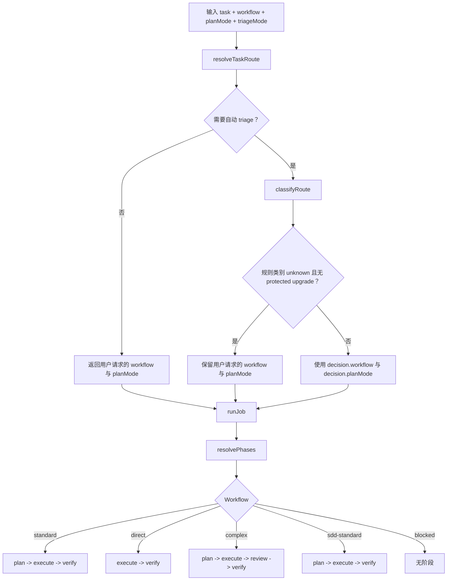
```mermaid
flowchart TD
  A["输入 task + workflow + planMode + triageMode"] --> B["resolveTaskRoute"]
  B --> C{"需要自动 triage？"}
  C -->|"否"| D["返回用户请求的 workflow 与 planMode"]
  C -->|"是"| E["classifyRoute"]
  E --> F{"规则类别 unknown 且无 protected upgrade？"}
  F -->|"是"| G["保留用户请求的 workflow 与 planMode"]
  F -->|"否"| H["使用 decision.workflow 与 decision.planMode"]
  D --> I["runJob"]
  G --> I
  H --> I
  I --> J["resolvePhases"]
  J --> K{"Workflow"}
  K -->|"standard"| L["plan -> execute -> verify"]
  K -->|"direct"| M["execute -> verify"]
  K -->|"complex"| N["plan -> execute -> review -> verify"]
  K -->|"sdd-standard"| O["plan -> execute -> verify"]
  K -->|"blocked"| P["无阶段"]
```

主要依据文件：

- `core/workflow/auto-route.js`
- `core/workflow/triage.js`
- `core/triage/rules.js`
- `core/engine/workflow-runner.js`
- `core/workflow/definition.js`

### `runJob` 状态机

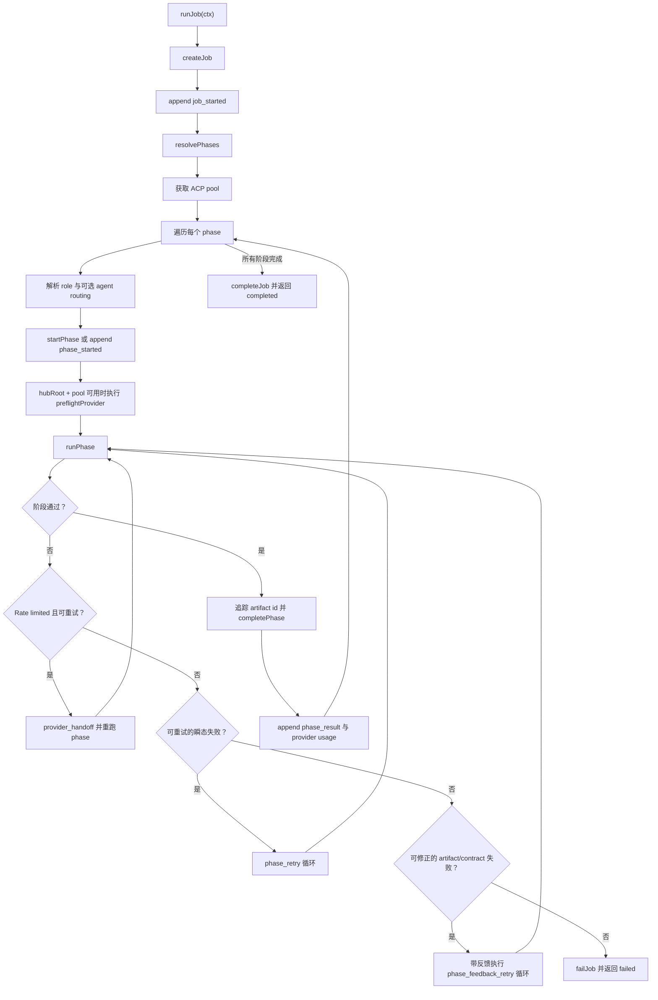
```mermaid
flowchart TD
  A["runJob(ctx)"] --> B["createJob"]
  B --> C["append job_started"]
  C --> D["resolvePhases"]
  D --> E["获取 ACP pool"]
  E --> F["遍历每个 phase"]
  F --> G["解析 role 与可选 agent routing"]
  G --> H["startPhase 或 append phase_started"]
  H --> I["hubRoot + pool 可用时执行 preflightProvider"]
  I --> J["runPhase"]
  J --> K{"阶段通过？"}
  K -->|"是"| L["追踪 artifact id 并 completePhase"]
  K -->|"否"| M{"Rate limited 且可重试？"}
  M -->|"是"| N["provider_handoff 并重跑 phase"]
  N --> J
  M -->|"否"| O{"可重试的瞬态失败？"}
  O -->|"是"| P["phase_retry 循环"]
  P --> J
  O -->|"否"| Q{"可修正的 artifact/contract 失败？"}
  Q -->|"是"| R["带反馈执行 phase_feedback_retry 循环"]
  R --> J
  Q -->|"否"| S["failJob 并返回 failed"]
  L --> T["append phase_result 与 provider usage"]
  T --> F
  F -->|"所有阶段完成"| U["completeJob 并返回 completed"]
```

主要依据文件：

- `core/engine/run-job.js`
- `core/contracts/failure.js`
- `core/contracts/phase-result.js`
- `core/agents/routing.js`
- `server/services/provider-quota.js`
- `server/services/quota-delegate-client.js`

### 阶段适配器流程

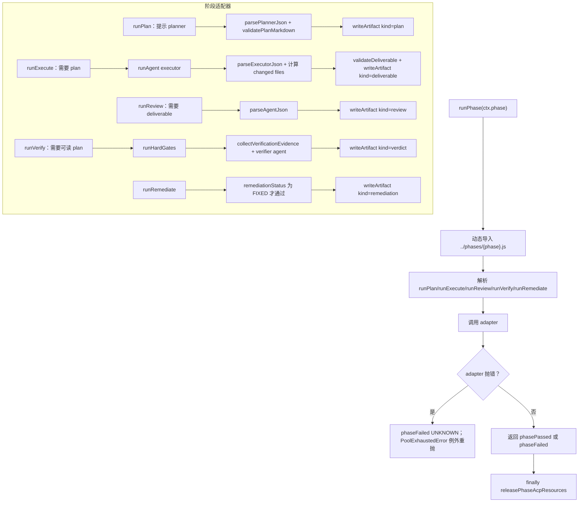
```mermaid
flowchart TD
  A["runPhase(ctx.phase)"] --> B["动态导入 ../phases/{phase}.js"]
  B --> C["解析 runPlan/runExecute/runReview/runVerify/runRemediate"]
  C --> D["调用 adapter"]
  D --> E{"adapter 抛错？"}
  E -->|"是"| F["phaseFailed UNKNOWN；PoolExhaustedError 例外重抛"]
  E -->|"否"| G["返回 phasePassed 或 phaseFailed"]
  G --> H["finally releasePhaseAcpResources"]

  subgraph Adapters["阶段适配器"]
    P1["runPlan：提示 planner"] --> P2["parsePlannerJson + validatePlanMarkdown"]
    P2 --> P3["writeArtifact kind=plan"]

    E1["runExecute：需要 plan"] --> E2["runAgent executor"]
    E2 --> E3["parseExecutorJson + 计算 changed files"]
    E3 --> E4["validateDeliverable + writeArtifact kind=deliverable"]

    R1["runReview：需要 deliverable"] --> R2["parseAgentJson"]
    R2 --> R3["writeArtifact kind=review"]

    V1["runVerify：需要可读 plan"] --> V2["runHardGates"]
    V2 --> V3["collectVerificationEvidence + verifier agent"]
    V3 --> V4["writeArtifact kind=verdict"]

    X1["runRemediate"] --> X2["remediationStatus 为 FIXED 才通过"]
    X2 --> X3["writeArtifact kind=remediation"]
  end
```

主要依据文件：

- `core/engine/run-phase.js`
- `core/phases/plan.js`
- `core/phases/execute.js`
- `core/phases/review.js`
- `core/phases/verify.js`
- `core/phases/remediate.js`
- `core/artifacts/artifact-store.js`
- `core/artifacts/validators.js`
- `core/agents/response-parser.js`

## 编排器 / 运行时 / 工作进程单元

### Hub 编排器循环

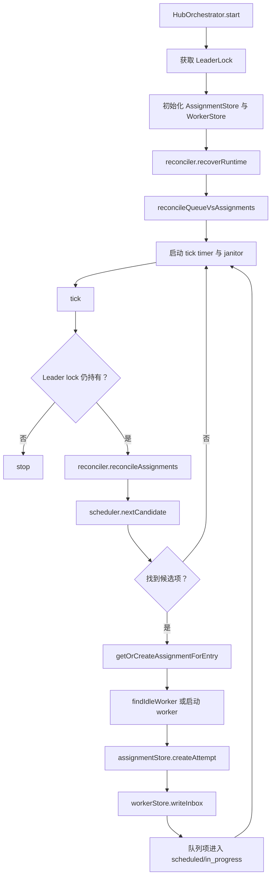
```mermaid
flowchart TD
  A["HubOrchestrator.start"] --> B["获取 LeaderLock"]
  B --> C["初始化 AssignmentStore 与 WorkerStore"]
  C --> D["reconciler.recoverRuntime"]
  D --> E["reconcileQueueVsAssignments"]
  E --> F["启动 tick timer 与 janitor"]

  F --> G["tick"]
  G --> H{"Leader lock 仍持有？"}
  H -->|"否"| I["stop"]
  H -->|"是"| J["reconciler.reconcileAssignments"]
  J --> K["scheduler.nextCandidate"]
  K --> L{"找到候选项？"}
  L -->|"否"| F
  L -->|"是"| M["getOrCreateAssignmentForEntry"]
  M --> N["findIdleWorker 或启动 worker"]
  N --> O["assignmentStore.createAttempt"]
  O --> P["workerStore.writeInbox"]
  P --> Q["队列项进入 scheduled/in_progress"]
  Q --> F
```

主要依据文件：

- `server/orchestrator/hub-orchestrator.js`
- `server/orchestrator/leader-lock.js`
- `shared/orchestrator/assignment-store.js`
- `shared/orchestrator/worker-store.js`
- `server/orchestrator/scheduler.js`
- `server/orchestrator/reconciler.js`

### Worker 生命周期

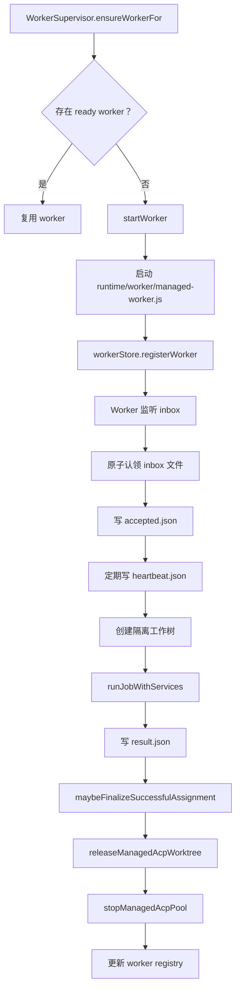
```mermaid
flowchart TD
  A["WorkerSupervisor.ensureWorkerFor"] --> B{"存在 ready worker？"}
  B -->|"是"| C["复用 worker"]
  B -->|"否"| D["startWorker"]
  D --> E["启动 runtime/worker/managed-worker.js"]
  E --> F["workerStore.registerWorker"]
  F --> G["Worker 监听 inbox"]
  G --> H["原子认领 inbox 文件"]
  H --> I["写 accepted.json"]
  I --> J["定期写 heartbeat.json"]
  J --> K["创建隔离工作树"]
  K --> L["runJobWithServices"]
  L --> M["写 result.json"]
  M --> N["maybeFinalizeSuccessfulAssignment"]
  N --> O["releaseManagedAcpWorktree"]
  O --> P["stopManagedAcpPool"]
  P --> Q["更新 worker registry"]
```

主要依据文件：

- `server/orchestrator/worker-supervisor.js`
- `runtime/worker/managed-worker.js`
- `runtime/git/worktree.js`
- `bridges/engine-bridge.js`
- `server/services/engine-runner.js`
- `bridges/runtime-services.js`
- `server/services/auto-finalizer.js`
- `server/services/acp-pool.js`

### 状态对账与失败路由

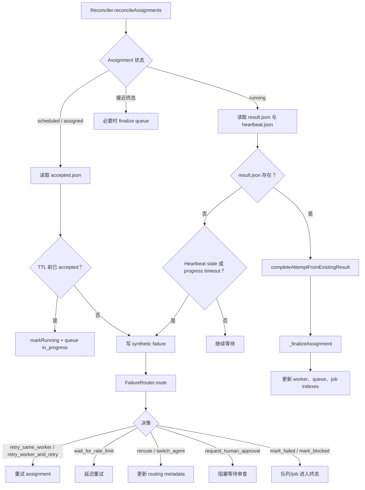
```mermaid
flowchart TD
  A["Reconciler.reconcileAssignments"] --> B{"Assignment 状态"}
  B -->|"scheduled / assigned"| C["读取 accepted.json"]
  B -->|"running"| D["读取 result.json 与 heartbeat.json"]
  B -->|"接近终态"| E["必要时 finalize queue"]

  C --> F{"TTL 前已 accepted？"}
  F -->|"是"| G["markRunning + queue in_progress"]
  F -->|"否"| H["写 synthetic failure"]

  D --> I{"result.json 存在？"}
  I -->|"是"| J["completeAttemptFromExistingResult"]
  I -->|"否"| K{"Heartbeat stale 或 progress timeout？"}
  K -->|"否"| L["继续等待"]
  K -->|"是"| H

  H --> M["FailureRouter.route"]
  J --> N["_finalizeAssignment"]
  M --> O{"决策"}
  O -->|"retry_same_worker / retry_worker_and_retry"| P["重试 assignment"]
  O -->|"wait_for_rate_limit"| Q["延迟重试"]
  O -->|"reroute / switch_agent"| R["更新 routing metadata"]
  O -->|"request_human_approval"| S["阻塞等待审查"]
  O -->|"mark_failed / mark_blocked"| T["队列/job 进入终态"]
  N --> U["更新 worker、queue、job indexes"]
```

主要依据文件：

- `server/orchestrator/reconciler.js`
- `server/orchestrator/failure-router.js`
- `server/orchestrator/acp-supervisor.js`
- `shared/orchestrator/assignment-store.js`
- `server/services/hub-queue.js`
- `server/services/job-store.js`

### ACP、工作树与沙箱边界

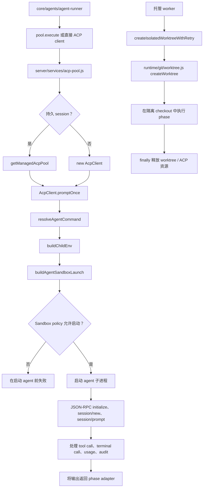
```mermaid
flowchart TD
  A["core/agents/agent-runner"] --> B["pool.execute 或直接 ACP client"]
  B --> C["server/services/acp-pool.js"]
  C --> D{"持久 session？"}
  D -->|"是"| E["getManagedAcpPool"]
  D -->|"否"| F["new AcpClient"]
  E --> G["AcpClient.promptOnce"]
  F --> G
  G --> H["resolveAgentCommand"]
  H --> I["buildChildEnv"]
  I --> J["buildAgentSandboxLaunch"]
  J --> K{"Sandbox policy 允许启动？"}
  K -->|"否"| L["在启动 agent 前失败"]
  K -->|"是"| M["启动 agent 子进程"]
  M --> N["JSON-RPC initialize、session/new、session/prompt"]
  N --> O["处理 tool call、terminal call、usage、audit"]
  O --> P["将输出返回 phase adapter"]

  Q["托管 worker"] --> R["createIsolatedWorktreeWithRetry"]
  R --> S["runtime/git/worktree.js createWorktree"]
  S --> T["在隔离 checkout 中执行 phase"]
  T --> U["finally 释放 worktree / ACP 资源"]
```

主要依据文件：

- `core/agents/agent-runner.js`
- `server/services/acp-pool.js`
- `server/services/acp-client-core.mjs`
- `runtime/git/worktree.js`
- `core/policy/child-env.js`
- `core/policy/agent-sandbox.js`
- `runtime/worker/managed-worker.js`

## 网页界面单元

### App 启动与路由

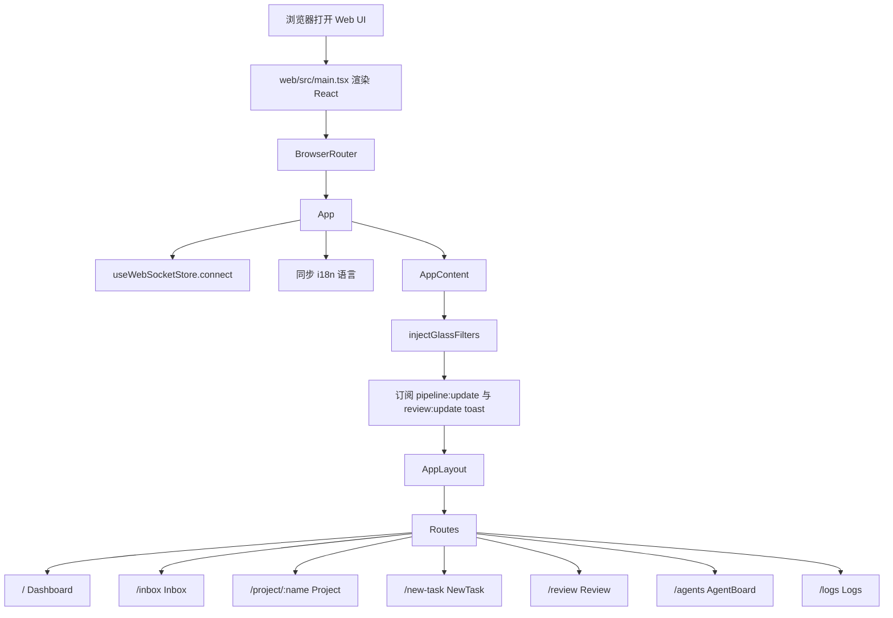
```mermaid
flowchart TD
  A["浏览器打开 Web UI"] --> B["web/src/main.tsx 渲染 React"]
  B --> C["BrowserRouter"]
  C --> D["App"]
  D --> E["useWebSocketStore.connect"]
  D --> F["同步 i18n 语言"]
  D --> G["AppContent"]
  G --> H["injectGlassFilters"]
  H --> I["订阅 pipeline:update 与 review:update toast"]
  I --> J["AppLayout"]
  J --> K["Routes"]
  K --> L["/ Dashboard"]
  K --> M["/inbox Inbox"]
  K --> N["/project/:name Project"]
  K --> O["/new-task NewTask"]
  K --> P["/review Review"]
  K --> Q["/agents AgentBoard"]
  K --> R["/logs Logs"]
```

主要依据文件：

- `web/src/main.tsx`
- `web/src/App.tsx`
- `web/src/app/store/websocket.ts`
- `web/src/components/layout/AppLayout.tsx`
- `web/src/components/layout/Sidebar.tsx`
- `web/src/pages/*.tsx`

### 仪表盘、项目页与任务创建

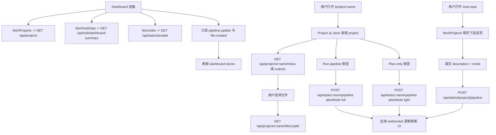
```mermaid
flowchart TD
  A["Dashboard 挂载"] --> B["fetchProjects -> GET /api/projects"]
  A --> C["fetchHubData -> GET /api/hub/dashboard-summary"]
  A --> D["fetchJobs -> GET /api/tasks/durable"]
  A --> E["订阅 pipeline:update 与 file:created"]
  E --> F["刷新 dashboard stores"]

  G["用户打开 /project/:name"] --> H["Project 从 store 读取 project"]
  H --> I["GET /api/projects/:name/inbox 或 outputs"]
  I --> J["用户选择文件"]
  J --> K["GET /api/projects/:name/files/:path"]
  H --> L["Run pipeline 按钮"]
  H --> M["Plan-only 按钮"]
  L --> O["POST /api/tasks/:name/pipeline planMode full"]
  M --> P["POST /api/tasks/:name/pipeline planMode light"]

  R["用户打开 /new-task"] --> S["fetchProjects 填充下拉选项"]
  S --> T["提交 description + mode"]
  T --> U["POST /api/tasks/{project}/pipeline"]
  O --> V["后续 websocket 更新刷新 UI"]
  P --> V
  U --> V
```

主要依据文件：

- `web/src/pages/Dashboard.tsx`
- `web/src/pages/Project.tsx`
- `web/src/pages/NewTask.tsx`
- `web/src/app/store/projects.ts`
- `web/src/app/store/hub.ts`
- `web/src/app/store/agents.ts`

### 审查、收件箱、日志、Agents 与产物

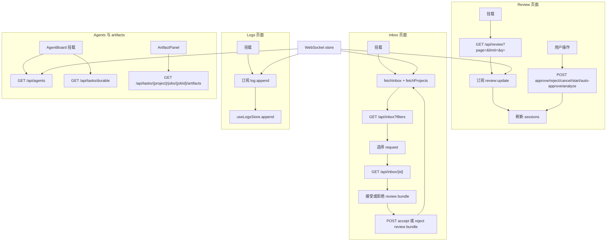
```mermaid
flowchart TD
  subgraph Review["Review 页面"]
    A1["挂载"] --> A2["GET /api/review?page=&limit=&q="]
    A2 --> A3["订阅 review:update"]
    A3 --> A4["刷新 sessions"]
    A5["用户操作"] --> A6["POST approve/reject/cancel/start/auto-approve/analyze"]
    A6 --> A4
  end

  subgraph Inbox["Inbox 页面"]
    B1["挂载"] --> B2["fetchInbox + fetchProjects"]
    B2 --> B3["GET /api/inbox?filters"]
    B3 --> B4["选择 request"]
    B4 --> B5["GET /api/inbox/{id}"]
    B5 --> B6["接受或拒绝 review bundle"]
    B6 --> B7["POST accept 或 reject review bundle"]
    B7 --> B2
  end

  subgraph Logs["Logs 页面"]
    C1["挂载"] --> C2["订阅 log:append"]
    C2 --> C3["useLogsStore.append"]
  end

  subgraph Agents["Agents 与 artifacts"]
    D1["AgentBoard 挂载"] --> D2["GET /api/agents"]
    D1 --> D3["GET /api/tasks/durable"]
    D4["ArtifactPanel"] --> D5["GET /api/tasks/{project}/jobs/{jobId}/artifacts"]
  end

  W["WebSocket store"] --> A3
  W --> B2
  W --> C2
  W --> D2
```

主要依据文件：

- `web/src/pages/Review.tsx`
- `web/src/app/store/review.ts`
- `web/src/pages/Inbox.tsx`
- `web/src/app/store/inbox.ts`
- `web/src/pages/Logs.tsx`
- `web/src/app/store/logs.ts`
- `web/src/pages/AgentBoard.tsx`
- `web/src/app/store/agents.ts`
- `web/src/components/shared/ArtifactPanel.tsx`

## 安装 / 角色配置 / 技能 / 自动化单元

### 安装、诊断与 Agent 就绪检查

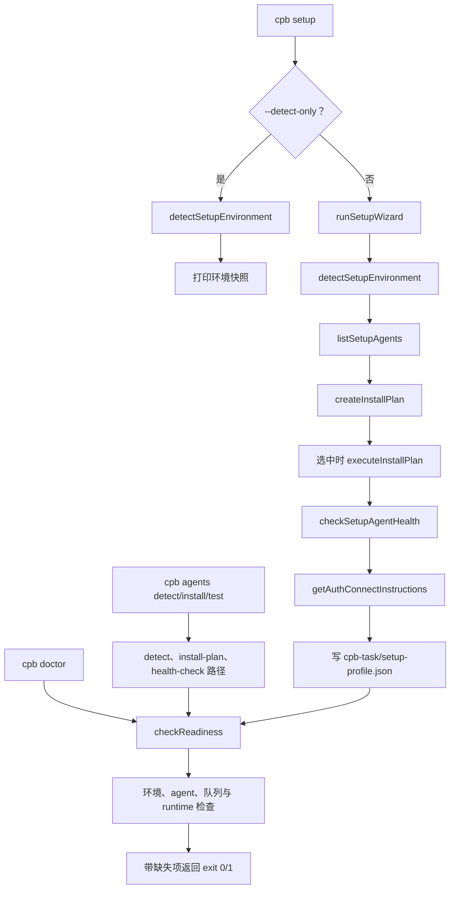
```mermaid
flowchart TD
  A["cpb setup"] --> B{"--detect-only？"}
  B -->|"是"| C["detectSetupEnvironment"]
  C --> D["打印环境快照"]
  B -->|"否"| E["runSetupWizard"]
  E --> F["detectSetupEnvironment"]
  F --> G["listSetupAgents"]
  G --> H["createInstallPlan"]
  H --> I["选中时 executeInstallPlan"]
  I --> J["checkSetupAgentHealth"]
  J --> K["getAuthConnectInstructions"]
  K --> L["写 cpb-task/setup-profile.json"]

  M["cpb doctor"] --> N["checkReadiness"]
  N --> O["环境、agent、队列与 runtime 检查"]
  O --> P["带缺失项返回 exit 0/1"]

  Q["cpb agents detect/install/test"] --> R["detect、install-plan、health-check 路径"]
  R --> N
  L --> N
```

主要依据文件：

- `cli/commands/setup.js`
- `core/setup/detect.js`
- `core/setup/wizard.js`
- `core/setup/install-plan.js`
- `core/setup/health-check.js`
- `core/setup/agent-catalog.js`
- `core/auth/connect.js`
- `cli/commands/doctor.js`
- `server/services/readiness-checks.js`
- `cli/commands/agents.js`

### 角色配置、Providers 与技能

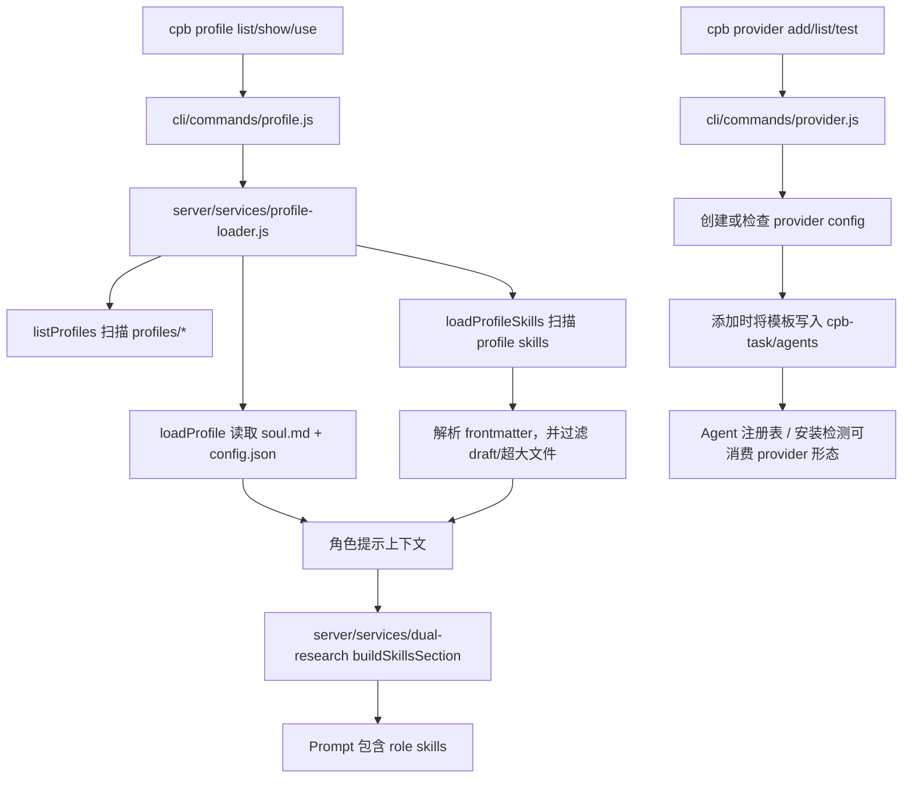
```mermaid
flowchart TD
  A["cpb profile list/show/use"] --> B["cli/commands/profile.js"]
  B --> C["server/services/profile-loader.js"]
  C --> D["listProfiles 扫描 profiles/*"]
  C --> E["loadProfile 读取 soul.md + config.json"]
  C --> F["loadProfileSkills 扫描 profile skills"]
  F --> G["解析 frontmatter，并过滤 draft/超大文件"]
  E --> H["角色提示上下文"]
  G --> H

  I["cpb provider add/list/test"] --> J["cli/commands/provider.js"]
  J --> K["创建或检查 provider config"]
  K --> L["添加时将模板写入 cpb-task/agents"]
  L --> M["Agent 注册表 / 安装检测可消费 provider 形态"]

  H --> N["server/services/dual-research buildSkillsSection"]
  N --> O["Prompt 包含 role skills"]
```

主要依据文件：

- `cli/commands/profile.js`
- `server/services/profile-loader.js`
- `cli/commands/provider.js`
- `core/setup/agent-catalog.js`
- `server/services/dual-research.mjs`
- `profiles/*`
- `skills/*`

### 演进、研究、审查分派与 SDD

```mermaid
flowchart TD
  A["cpb evolve-multi"] --> B["cli/commands/evolve-multi.js"]
  B --> C["runtime/evolve/multi-evolve.js"]
  C --> D["multi-evolve 控制器"]
  D --> E["scanProject"]
  E --> F["ACP scan / issue discovery"]
  F --> G["pushIssues + hubEnqueue"]
  G --> H["配置允许时 runManagedWorker"]

  I["cpb research"] --> J["cli/commands/research.js"]
  J --> K["server/services/dual-research.mjs"]
  K --> L["启动两条 ACP research lane"]
  L --> M["merge-research"]
  M --> N["research artifact 写入 inbox"]

  O["审查分派"] --> P["server/routes/review.js 或 channels.js"]
  P --> Q["server/services/review-dispatch-runner.mjs"]
  Q --> R["审查会话服务"]
  R --> S["双 ACP 审查循环"]

  T["cpb sdd init/bootstrap/verify/drift"] --> U["cli/commands/sdd.js"]
  U --> V["templates/sdd 与 wiki/projects/{project}/sdd"]
  V --> W["server/services/sdd verify/drift"]
  W --> X["core/sdd/trace metadata"]
```

主要依据文件：

- `cli/commands/evolve-multi.js`
- `runtime/evolve/multi-evolve.js`
- `runtime/evolve/multi-evolve.js`
- `cli/commands/research.js`
- `server/services/dual-research.mjs`
- `server/services/merge-research.mjs`
- `server/services/review-dispatch-runner.mjs`
- `server/services/review-dispatch.js`
- `server/services/review-session.js`
- `cli/commands/sdd.js`
- `core/sdd/trace.js`
- `templates/sdd/*`

## 源码索引

后续代码变动后，可按下表更新对应流程图。

| 单元 | 源码文件 |
| --- | --- |
| CLI 命令行 | `cpb`, `cli/cpb.mjs`, `cli/commands/*.js` |
| 服务端/API | `server/index.js`, `server/routes/*.js`, `server/services/*.js` |
| 核心引擎 | `core/workflow/*`, `core/engine/*`, `core/phases/*`, `core/contracts/*` |
| 编排器 | `server/orchestrator/*` |
| 运行时/ACP | `runtime/worker/managed-worker.js`, `runtime/evolve/multi-evolve.js`, `runtime/git/worktree.js`, `bridges/runtime-services.js`, `server/services/acp-pool.js`, `server/services/acp-client-core.mjs` |
| 网页界面 | `web/src/App.tsx`, `web/src/pages/*`, `web/src/app/store/*`, `web/src/components/*` |
| 安装/自动化 | `core/setup/*`, `profiles/*`, `skills/*`, `server/services/init-project.mjs`, `server/services/provider-soak.mjs`, `server/services/validate-scan-readiness.mjs`, `runtime/evolve/*`, `core/sdd/*` |
