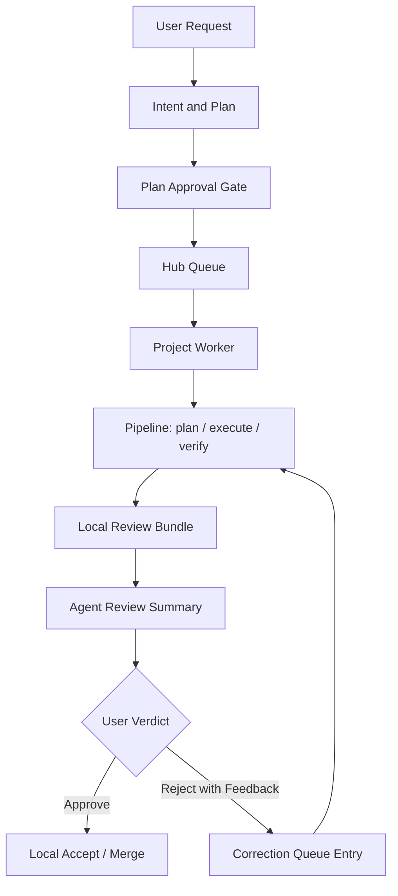

# CPB Closed-Loop MVP 规划

日期：2026-06-02

本文定义 CodePatchbay 的闭环 MVP。MVP 的目标不是展示 demo，而是在真实项目、真实 agent、真实并发下证明一条最小但可运营的工程交付链路。

## 一句话目标

用户把需求交给 CPB，CPB 拆解计划，用户批准计划，流水线真实执行并纠偏，最后生成本地 Review Bundle。用户可以批准合入，也可以带意见拒绝；拒绝后 CPB 基于用户意见和 agent 审阅缺陷重新执行，直到用户批准。

## MVP 范围

MVP 必须完成：

1. 无 GitHub 配置时也能完成完整交付闭环。
2. 主流水线不使用 browser-agent。
3. 不使用 fake ACP、fake LLM、fake provider 作为验收。
4. 保持真实并发能力，不通过降低并发换取稳定。
5. 支持运行时动态调整项目并发上限和 provider 上限，不重启 hub/worker。
6. ACP 不设全局总上限，只限制 provider 上限。
7. 完成一次真实 request -> plan -> approval -> execute -> verify -> Review Bundle -> approve/reject loop。
8. 最小 trace 能说明每个 job 的 phase、agent、provider、diff 和失败原因。

MVP 暂不完成：

1. browser-agent 主链路接入。
2. 完整 IM 操作台。
3. 完整架构可视化。
4. 完整文件级和工具调用级 Trace Explorer。
5. 完整 Experience Ledger 注入 planning/execution/review。
6. GitHub/GitLab PR 自动发布。

这些能力进入完整产品规划。

## 当前资产和缺口

| 能力 | 当前资产 | MVP 缺口 |
|---|---|---|
| 队列和项目执行 | `server/services/hub-queue.js`、`runtime/worker/managed-worker.js`、`server/orchestrator/*` | 动态上限、真实并发验收、非 GitHub finalization |
| agent 配置 | `server/services/agent-config.js`、`cli/commands/config.js` | 清理无效 variant，固定主链路不走 browser-agent |
| 审阅会话 | `server/routes/review.js`、`server/services/review-session.js` | reject 后重新入队，而不是只结束 session |
| 自动 finalizer | `server/services/auto-finalizer.js` | 无 issue link 时生成本地 Review Bundle |
| 事件日志 | `server/services/event-store.js`、`core/engine/run-job.js` | 最小 trace 还不到工具调用和文件修改级 |
| 并发池 | `server/services/acp-pool.js` | provider 上限运行时更新 |
| 经验提取 | `server/services/experience-extractor.js` | MVP 只沉淀候选，不做完整经验注入 |
| IM 通道 | `server/routes/channels.js`、`server/services/channel-queue-actions.js` | MVP 不做完整通道产品化 |

## MVP 架构闭环

## 硬性产品语义

### GitHub 不是核心依赖

MVP 的核心交付物是 Review Bundle，不是 GitHub PR。GitHub PR 后续只是 Review Bundle 的一个 transport。

MVP 验收时必须在 GitHub App 缺失或禁用的情况下完成本地交付闭环。

### 不 fake

MVP 验收不允许使用 fake ACP、fake provider、fake LLM responder 来证明流水线可用。单元测试可以使用普通 fixture 验证纯函数和文件系统逻辑，但不能把 fake agent 成功当成产品验收。

### 动态上限不杀运行中任务

运行时下调项目上限或 provider 上限时，不杀已经运行的任务或 ACP 调用。新上限只影响新的 claim 和新的 ACP request。当前 active 超过新上限时进入 over-capacity 状态，等待自然回落。

### ACP 总上限不设置

MVP 不设置 ACP global total。可调旋钮只有：

1. 每项目 active 上限。
2. 单 provider active 上限。
3. 可选的项目 override。

## 1 人天任务拆分

总估算：39 人天。

这个估算包含实现、测试、最小文档和本地验证。不包含等待真实 provider 返回的墙钟时间。

### A. 真实运行基线，6 人天

| ID | 任务 | 代码落点 | 交付物 | 验收 |
|---|---|---|---|---|
| A1 | 当前状态诊断和清理手册 | `cli/commands/doctor*`、jobs report/reconcile 相关命令 | 一份真实运行前检查清单 | `doctor`、`jobs report`、`jobs reconcile` 能解释当前 stale jobs，不执行 fake |
| A2 | 清理主流水线 agent 配置 | `server/services/agent-config.js`、`cli/commands/config.js` | plan/execute/verify 的默认 agent 配置说明和修正 | 新 queue entry metadata 不再出现 browser-agent 或 provider `none` |
| A3 | browser-agent 主链路隔离 | agent config、project config、文档 | browser-agent 标记为独立测试 lane | 主流水线真实任务不会尝试 Playwright/browser provider |
| A4 | finalizer 默认模式调整 | `runtime/worker/managed-worker.js`、hub config | MVP 默认使用 local 或 dry-run finalizer | GitHub App 缺失时 worker 不因 PR 模式直接失败 |
| A5 | 真实最小测试项目准备 | project registry、测试 fixture repo | 一个可回滚的真实 pipeline 测试项目 | 真实 agent 可以在该项目产生真实 diff |
| A6 | 失败报告收敛 | `jobs report`、failure router/reporting | 失败类别说明：unavailable/rate_limited/contract_invalid/timeout | 最近失败能给出下一步操作，而不是只有 failed |

### B. 动态上限控制面，8 人天

| ID | 任务 | 代码落点 | 交付物 | 验收 |
|---|---|---|---|---|
| B1 | Runtime limits schema | 新增 `server/services/runtime-limits.js` 或同等模块 | schema：project limits、project overrides、provider limits、version | 能表达无 ACP total，只限制项目和 provider |
| B2 | RuntimeLimitsService | 新 service + hub config storage | 原子读写、校验、版本号、updatedBy、reason | PATCH 后不用重启即可读取新版本 |
| B3 | Limits API | hub/server routes | `GET/PATCH /api/runtime-limits` | API 能返回有效上限、版本、最近修改信息 |
| B4 | CLI 动态调整 | `cli/commands/*` | `cpb limits set --project <id> --max-active <n>`、`--provider <name> --max <n>` | 命令执行后 hub/worker 不重启，新值可见 |
| B5 | scheduler 动态读取 | `server/orchestrator/scheduler.js` | 每次调度前读取最新 limits snapshot | 上调后新任务可被 claim，下调后停止新的超额 claim |
| B6 | worker 调度动态化 | `server/orchestrator/scheduler.js` | 调度使用 runtime limits，而不是旧 worker constructor 固定值 | 运行中的 worker 响应项目上限变化 |
| B7 | ACP pool providerMax 动态化 | `server/services/acp-pool.js` | `updateLimits()` 或同等接口 | 下调不杀 active，上调允许更多同 provider request |
| B8 | limit audit event | `server/services/event-store.js`、UI/CLI | `runtime_limits_updated` 事件 | 记录旧值、新值、actor、reason、影响范围 |

### C. Local Review Bundle，7 人天

| ID | 任务 | 代码落点 | 交付物 | 验收 |
|---|---|---|---|---|
| C1 | Review Bundle schema | 新增 `server/services/review-bundle.js` 或 schema 文件 | `review-bundle.schema.json` 或 JS schema | 包含 request、plan、job、diff、tests、agentReview、recommendation |
| C2 | Bundle writer | `auto-finalizer`、bundle service | 成功 job 自动生成 `review-bundle.json` | 本地文件落盘，能通过 job/session 查到 |
| C3 | Markdown 摘要 | bundle service | `review-bundle.md` | 人类 10 秒内能看懂改了什么、测了什么、建议批准还是拒绝 |
| C4 | finalizer 解耦 issue link | `server/services/auto-finalizer.js` | 无 issue link 时走 local bundle path | 无 GitHub 配置时不返回 `NO_ISSUE_LINK` 作为终局失败 |
| C5 | Bundle API | review routes 或 job routes | API 返回 bundle summary/detail/diff | 前端和 CLI 都能读取 Review Bundle |
| C6 | Review UI 最小显示 | `web/` review 页面/store/types | 显示 summary、changed files、tests、agent recommendation | 不依赖 GitHub PR 即可完成审阅 |
| C7 | Bundle 测试 | tests | schema、writer、no GitHub、no diff、有 diff 测试 | 使用真实 git fixture，不使用 fake agent 成功作为验收 |

### D. 拒绝反馈循环，6 人天

| ID | 任务 | 代码落点 | 交付物 | 验收 |
|---|---|---|---|---|
| D1 | reject 语义改造 | `server/routes/review.js`、review session service | reject 保存 user feedback，不直接结束为 expired | session 保留 rejected round 和用户意见 |
| D2 | correction queue entry | `server/routes/review.js`、`server/services/hub-queue.js` | reject 后创建 correction entry | queue entry metadata 带 origin bundle、round、feedback |
| D3 | correction context builder | pipeline context/phase context | 把上一轮 diff、agent 缺陷、用户意见注入下一轮 | 新任务不是从零开始，而是针对拒绝点修正 |
| D4 | rounds 版本链 | review session model/store | `rounds[]` 记录每轮 bundle/verdict/status | UI/API 能看到第几轮、每轮结论 |
| D5 | accept/local merge | review routes/finalizer | approve 后执行 local accept 或标记 ready-to-merge | 无 GitHub 时可以完成本地批准路径 |
| D6 | reject loop 集成测试 | tests | bundle -> reject -> correction entry -> next bundle 的集成测试 | 真实 git fixture 验证，不用 fake provider 验收 |

### E. 真实并发验证，5 人天

| ID | 任务 | 代码落点 | 交付物 | 验收 |
|---|---|---|---|---|
| E1 | 同项目并发脚本 | test/runbook | 提交同项目 3 个真实任务 | 上限为 2 时最多 2 个 active，第三个等待 |
| E2 | 多项目并发脚本 | test/runbook | 两个项目同时跑真实任务 | 项目之间不互相阻塞 |
| E3 | 动态上限验证脚本 | runtime limits API/CLI | 运行中执行 1 -> 2 -> 3 -> 1 调整 | 上调开始 claim，下调不杀 active |
| E4 | providerMax 验证脚本 | ACP pool/runtime limits | 同 provider 多请求饱和测试 | providerMax 生效，超过部分排队，不降成全局串行 |
| E5 | stale lease 恢复验证 | reconciler/worker | 模拟 worker 退出和 lease 过期 | reconcile 后没有 running 僵尸任务 |

### F. MVP 最小 trace，5 人天

| ID | 任务 | 代码落点 | 交付物 | 验收 |
|---|---|---|---|---|
| F1 | event schema 扩展 | `server/services/event-store.js` | `runtime_limits_updated`、`review_bundle_created`、`correction_started` | 事件可追加、可读取、可 redaction |
| F2 | phase diff snapshot | `core/engine/run-job.js` 或 worker wrapper | phase 前后记录 changed files 和 diff summary | 能看出哪个 phase 引入了文件变化 |
| F3 | agent/provider trace summary | `core/engine/run-job.js` | agent handoff、provider retry、quota/backoff 更可读 | 单个 job 的失败链路可解释 |
| F4 | trace API 最小版 | job/review routes | 按 job id 返回 timeline | Review Bundle 可以链接到 job timeline |
| F5 | trace 测试 | tests | event order、redaction、diff summary 测试 | secret 不泄漏，事件顺序稳定 |

### G. MVP 验收和发布，3 人天

| ID | 任务 | 代码落点 | 交付物 | 验收 |
|---|---|---|---|---|
| G1 | MVP runbook | `docs/product/` | 真实验收步骤文档 | 按文档能重复跑一轮真实任务 |
| G2 | 真实端到端验收 | CLI/UI/hub/worker | 一次真实 closed-loop 记录 | 无 GitHub、无 fake、真实 diff、可 reject correction |
| G3 | 风险和缺口复盘 | `docs/product/` | MVP 完成报告 | 明确哪些能力进入完整产品规划 |

## 真实验收脚本口径

MVP 的最终验收必须至少跑以下真实场景：

1. GitHub App 不配置或禁用。
2. hub 和 worker 已启动。
3. 提交一个会产生小 diff 的真实任务。
4. 用户批准计划。
5. pipeline 真实执行并生成 Review Bundle。
6. agent 给出 approve/reject recommendation。
7. 用户拒绝并填写意见。
8. CPB 创建 correction queue entry。
9. correction pipeline 生成新版 Review Bundle。
10. 用户批准。
11. 本地 accept/merge 或 ready-to-merge 状态完成。
12. 全过程事件可追溯。

并发验收必须至少跑：

1. 同项目 3 个真实任务，验证项目上限。
2. 两个项目同时跑真实任务，验证多项目隔离。
3. 运行中调整项目上限，验证无需重启。
4. 运行中调整 providerMax，验证无需重启。
5. 模拟 worker 退出，验证 stale lease 恢复。

## MVP 完成标准

MVP 完成时必须满足：

1. 无 GitHub 配置时，closed-loop 任务可以完成。
2. 主流水线不触发 browser-agent。
3. 没有 fake ACP 或 fake provider 被用于产品验收。
4. 项目上限和 provider 上限可以运行时调整。
5. ACP global total 未设置。
6. Review Bundle 可读、可审、可追溯。
7. reject 会触发 correction loop。
8. 真实并发验证通过。
9. 失败时能定位到 phase、agent/provider、主要原因和相关 diff。

## 主要风险

| 风险 | 影响 | 缓解 |
|---|---|---|
| 真实 provider 不稳定 | 验收时间不可控 | 记录真实失败，按 failure kind 分类，不用 fake 成功掩盖 |
| finalizer 与 GitHub 绑定太深 | 无 GitHub MVP 卡住 | 先实现 local bundle path，再保留 GitHub as transport |
| 动态上限引入竞态 | 并发 claim 出现超额 | limits snapshot 带 version；下调只阻止新 claim，不杀 active |
| reject loop 污染原始 session | 审阅历史不可读 | rounds 版本链必须先做 |
| trace 粒度不足 | 失败仍难定位 | MVP 至少做到 phase diff、provider handoff、review bundle link |

## MVP 之后

MVP 完成后，项目进入完整产品阶段。下一阶段优先做：

1. 多项目审计工作台。
2. 完整工具调用和文件修改级 Trace Explorer。
3. Experience Ledger 注入 planning/execution/review。
4. IM 通道完整操作。
5. browser-agent 独立真实验证后接入 UI lane。
6. GitHub/GitLab/local patch 多 transport。
