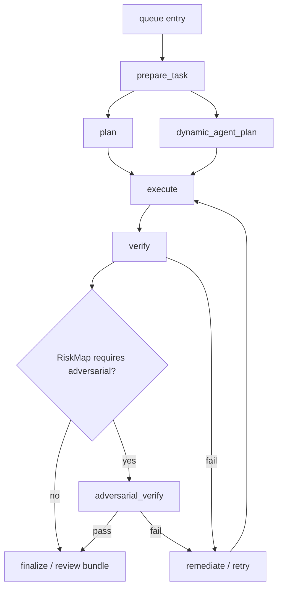

# CPB Dynamic Workflow / RiskMap / Adversarial Verification Plan

日期：2026-06-06

本文把 CPB 下一阶段的执行模型从固定线性流水线推进到 CodeGraph 强绑定的动态 DAG。核心目标不是“多几个 agent”，而是让系统在每个任务开始前理解项目边界、生成任务风险地图、按 DAG 调度可并行节点，并在普通验证之后对高风险任务做独立对抗性验证。

## 背景判断

Claude Dynamic Workflows 的关键启发是：workflow 不应该是静态 prompt 串，而应该在运行时根据任务、项目结构、风险和验证结果动态生成执行图。

CPB 当前已经具备队列、provider 池、workflow phase、retry/remediation、verify verdict、event store 和 CodeGraph 注入基础，但还缺五件事：

1. 项目注册时形成稳定的代码理解基线。
2. 每个任务执行前生成 task-level RiskMap。
3. 用 DAG 表达任务依赖和可并行节点，而不是固定 phase 数组。
4. 在 `verify` 之后根据风险执行 `adversarial_verify`。
5. 让 orchestrator 拥有常驻 control-plane ACP，用于维护调度语境、失败诊断和 provider 健康摘要。

## 已确认决策

### 1. CodeGraph 是强依赖

项目注册和任务准备必须依赖 CodeGraph。`project-code-index` 和 `repo-graph` 这类 heuristic fallback 已经删除，不再恢复。

如果 CodeGraph 不可用：

1. 项目不能进入 ready 状态。
2. 新任务不能进入 pipeline 执行态。
3. UI/CLI/API 必须返回明确的 `codegraph_unavailable` 阻断原因。
4. 系统不能悄悄降级为低置信度图谱。

### 2. 注册项目时生成 Project Capability Map

项目注册或 attach 后，系统用 CodeGraph 扫描项目并生成项目级地图：

| 产物 | 内容 |
|---|---|
| `project_capability_map` | 核心模块、入口、公共 API、测试面、构建命令、主要数据流 |
| `safety_boundary_map` | 权限、认证、secret、文件系统、网络、GitHub 写入、子进程、provider 调用边界 |
| `high_risk_area_map` | 调度、并发、ACP pool、worktree、event store、finalizer、security-sensitive modules |
| `confidence` | 必须是 `high`，否则项目不可调度 |

这张图不是一次性资产。它必须在文件变化、合并、项目配置变化、CodeGraph re-index 后增量刷新。

### 3. RiskMap 放进每个任务的准备步骤

orchestrator 不判断任务是否高风险，也不判断是否需要对抗性验证。orchestrator 只调度。

每个任务运行前必须先进入 `prepare_task`，该步骤读取最新 Project Capability Map 和任务文本，生成任务级 RiskMap：

```json
{
  "riskLevel": "low|medium|high|critical",
  "domains": ["scheduler", "security", "provider_pool"],
  "highRiskFiles": ["server/orchestrator/hub-orchestrator.js"],
  "safetyBoundaries": ["subprocess", "github_write"],
  "verificationDepth": "standard|strict|paranoid",
  "adversarialRequired": true,
  "adversarialFocus": ["race conditions", "privilege boundary", "stale state recovery"],
  "confidence": "high"
}
```

### 4. DAG 是任务执行模型

当前的 `plan -> execute -> verify -> review/finalize` 可以作为 DAG 的默认线性实例，但 runtime 应该转向显式 DAG：



DAG 的价值是表达依赖和 ready nodes。它本身不保证 provider 池吃满；是否吃满取决于 ready nodes 数量、provider 上限、agent 选择和任务可并行度。

### 5. 对抗性验证在普通 verify 之后

执行顺序固定为：

1. `execute`
2. `verify`
3. `adversarial_verify`（仅当 RiskMap 要求）
4. `remediate/retry` 或 `finalize`

普通 verifier 负责判断任务是否完成。对抗性 verifier 负责攻击实现假设，包括：

1. 安全边界绕过。
2. 并发和 stale state。
3. 权限矩阵误判。
4. provider pool 泄漏或饥饿。
5. worktree / event store / finalizer 的跨任务污染。
6. 测试缺口和伪验证。

### 6. 动态 agent 配置替代固定配置

agent 数量和角色不再是固定配置。`prepare_task` 应基于 RiskMap 和 DAG 生成 `dynamic_agent_plan`：

| 风险 | 默认配置 |
|---|---|
| low | 1 executor + standard verifier |
| medium | executor + verifier，必要时 reviewer |
| high | executor + independent verifier + adversarial verifier |
| critical | stronger executor + independent verifier + adversarial verifier + human approval gate |

provider 调度只受 provider 上限约束，不再引入项目级全局上限或 ACP total cap。项目级上限如果存在，只能是用户显式 runtime limit，而不是系统为吃满池子做的隐藏 cap。

### 7. Orchestrator 只做调度

orchestrator 的职责边界：

1. 读取 queue entries。
2. 读取 DAG ready nodes。
3. 根据 provider capacity 和 node dependency 调度。
4. 记录状态和事件。
5. 不判断风险。
6. 不选择是否 adversarial。
7. 不修改 RiskMap。

风险判断属于 `prepare_task` / RiskMap service。验证深度属于 DAG node metadata。

### 8. Orchestrator 常驻 control-plane ACP

orchestrator 应该拥有一个常驻的 supervisor ACP session，但它不是 worker，也不直接执行代码修改。

这个 resident supervisor 的职责是维护控制面语境，而不是替代确定性调度：

1. 解释 Project Capability Map、RiskMap、DAG 和 Dynamic Agent Plan 的控制面含义。
2. 维护 provider health、rate-limit、stale worker、失败模式和 retry/remediation 建议的摘要。
3. 在复杂失败、长时间无进展、provider 退化、adversarial fail 或人类 reject 后给出诊断建议。
4. 为 `prepare_task`、scheduler、reconciler 提供缓存的 advisory state。
5. 将 supervisor 决策写入 durable state，便于审查和回放。

边界要求：

1. deterministic scheduler 仍然负责最终调度决定。
2. resident supervisor 不在每个 tick 上同步调用，不阻塞普通 claim hot path。
3. supervisor ACP 必须和 worker ACP pool 隔离，不默认占用 planner/executor/verifier 的 provider slot。
4. supervisor 输出必须经过 schema 校验；无效、超时或不可用时系统走确定性 fallback。
5. supervisor 不能修改 RiskMap 或代码，只能写控制面建议、诊断和健康摘要。

## 目标架构产物

| 产物 | 存储/暴露建议 | 用途 |
|---|---|---|
| Project Capability Map | project config + event snapshot | 项目级能力和边界基线 |
| Task RiskMap | queue/job metadata + artifact | 每次任务的风险判定和验证要求 |
| Workflow DAG | job metadata + event store | 节点依赖、ready 状态、重试路径 |
| Dynamic Agent Plan | job metadata | agent role/provider/model/independence 要求 |
| Adversarial Verdict | artifact + event store | 独立对抗性验证结果 |
| Orchestrator Supervisor State | hub runtime state + supervisor decisions | 常驻控制面语境、provider 健康、失败诊断和 advisory 调度建议 |

## PR 拆分

这些 PR 应尽量单独可测、可回滚。每个 PR 都必须使用 CodeGraph 做项目定位，不能恢复 heuristic fallback。

### DW-01: CodeGraph project readiness gate and capability map

目标：项目注册/attach 后必须有 CodeGraph ready 状态，并生成 Project Capability Map。

范围：

1. 新增或扩展项目注册状态，记录 CodeGraph scan/version/updatedAt。
2. 定义 `project_capability_map`、`safety_boundary_map`、`high_risk_area_map` schema。
3. CLI/API/UI 在 CodeGraph unavailable 时显示阻断原因。
4. 不恢复 `project-code-index` 或 `repo-graph`。

验收：

1. CodeGraph 不可用时项目不可调度。
2. CodeGraph 可用时项目地图可读。
3. 单元测试覆盖 ready/unavailable/stale 三态。

### DW-02: prepare_task phase and task RiskMap service

目标：每个任务进入 pipeline 前先生成 RiskMap。

范围：

1. 新增 `prepare_task` phase 或等价 preflight node。
2. RiskMap service 读取 Project Capability Map 和任务文本。
3. 输出 risk level、domains、highRiskFiles、verificationDepth、adversarialRequired。
4. queue/job metadata 持久化 RiskMap。

验收：

1. 安全/并发/provider/worktree 任务会被标为 high risk。
2. docs-only 任务默认 low/medium。
3. CodeGraph 缺失时任务 blocked，不进入 execute。

### DW-03: Workflow DAG schema and linear compatibility layer

目标：把现有线性 workflow 表达为 DAG，为后续并行 ready-node 调度做铺垫。

范围：

1. 定义 DAG node/edge/status schema。
2. 将 `standard` workflow materialize 成默认线性 DAG。
3. 兼容现有 phase artifact 和 event store。
4. 记录 node_started/node_completed/node_failed 事件。

验收：

1. 现有任务仍按 plan/execute/verify 跑通。
2. DAG 状态可从 job metadata 或 events 读出。
3. 失败和 retry 能落在具体 node。

### DW-04: DAG-ready scheduler and provider-only capacity

目标：orchestrator 改为调度 DAG ready nodes，并只受 provider capacity 约束。

范围：

1. scheduler 读取 DAG ready nodes。
2. provider lease 只按 provider limit 判断。
3. 移除任何隐式项目总 cap 或 ACP total cap。
4. 支持同一 job 内多个 independent ready nodes 并行。

验收：

1. ready nodes 不满足依赖时不会调度。
2. 多个 ready nodes 在 provider 有空位时并行调度。
3. provider 满时排队而不是失败。

### DW-05: Dynamic agent plan generation

目标：基于 RiskMap 生成每个 DAG node 的 agent/provider/model/independence 要求。

范围：

1. 新增 `dynamic_agent_plan` 产物。
2. RiskMap riskLevel 映射到 agent roles。
3. high/critical 风险强制 independent verifier。
4. agent plan 进入 prompt builder 和 queue assignment metadata。

验收：

1. low-risk 任务不生成过度 agent 配置。
2. high-risk 任务生成 adversarial verifier 和 independent verifier。
3. provider 不可用时能给出明确 blocked/handoff 原因。

### DW-06: adversarial_verify node after verify

目标：在普通 verify 通过后，根据 RiskMap 执行对抗性验证。

范围：

1. 新增 `adversarial_verify` phase/node。
2. prompt 只允许攻击假设和验证缺口，不允许直接实现。
3. verdict schema 区分 verifier verdict 和 adversarial verdict。
4. adversarial fail 进入 remediation/retry，并携带 focus/fix_scope。

验收：

1. `verify` fail 时不跑 adversarial。
2. `verify` pass 且 RiskMap required 时跑 adversarial。
3. adversarial fail 会把对抗性发现注入下一轮 remediation。

### DW-07: DAG/RiskMap/adversarial observability

目标：CLI/API/UI 能看见 DAG、RiskMap 和 adversarial verdict。

范围：

1. job detail API 返回 RiskMap、DAG node 状态、agent plan。
2. CLI artifacts/status 输出关键字段。
3. Web job/detail 页面展示风险、DAG、验证链路。
4. event store timeline 包含 DAG node transitions。

验收：

1. 用户能看出为什么跑了 adversarial。
2. 用户能看出哪个 DAG node 失败。
3. Review Bundle 链接到 RiskMap 和 adversarial verdict。

### DW-08: End-to-end acceptance and migration runbook

目标：提供真实验收脚本和迁移说明。

范围：

1. 文档化旧 workflow 到 DAG 的迁移。
2. 提供高风险任务真实验收 runbook。
3. 提供 CodeGraph unavailable 的阻断验收。
4. 覆盖 verify -> adversarial_verify -> remediation 的端到端测试。

验收：

1. 一次真实 high-risk 任务触发 adversarial。
2. 一次 CodeGraph unavailable 任务被阻断。
3. 一次 adversarial fail 成功进入 retry/remediation。

Runbook: [DW-08 Migration Runbook](dw08-migration-runbook.md) covers the `index_unavailable` to `codegraph_unavailable` and `WORKCPBS` to `WORKFLOWS` migration.

### DW-09: Resident orchestrator supervisor ACP

目标：让常驻 orchestrator 拥有一个 control-plane ACP session，用于维护调度语境、provider 健康、失败诊断和 retry/remediation/adversarial 的 advisory state。

范围：

1. 将现有 lazy `AcpSupervisor` 提升为 resident supervisor lifecycle。
2. orchestrator 启动时初始化 supervisor ACP，并记录 heartbeat、session id、provider key、健康状态和最近活动。
3. supervisor ACP 使用独立 control-plane budget / lease，不默认占用 worker provider pool 的 planner/executor/verifier slots。
4. supervisor 定期或事件驱动刷新 provider health、stale worker、failed target、RiskMap/DAG/adversarial 摘要。
5. FailureRouter / Reconciler / prepare_task 读取 supervisor advisory state，但最终执行必须经过 deterministic policy 和 schema 校验。
6. supervisor 决策、失败诊断、invalid output、timeout 和 fallback 都写入 durable state。

验收：

1. `hub-orch start` 后能看到 resident supervisor ACP health，不需要等失败发生才 lazy init。
2. supervisor down / timeout / invalid JSON 时，orchestrator 继续 deterministic 调度并记录 fallback。
3. control-plane ACP 不减少 worker provider pool 可用 slot。
4. 复杂失败会保存 supervisor decision，并能被 Reconciler 用作 retry/remediation/adversarial context。
5. provider health 摘要来自真实 ACP pool / quota / lease 状态，不靠静态配置猜测。
6. tests 覆盖 lifecycle、fallback、schema validation、provider-slot isolation 和 failure diagnosis handoff。

## 入队 CPB 任务口径

每个 CPB 任务都应包含以下约束：

1. 先用 CodeGraph 定位相关代码，再编辑。
2. 引用本文档作为需求来源。
3. 保持 PR 小而原子。
4. 不恢复 `project-code-index` / `repo-graph`。
5. 不用 fake ACP/provider 成功作为产品验收。
6. 添加聚焦测试，并报告未覆盖风险。
7. 对 control-plane ACP 和 worker ACP pool 做资源隔离，不让 supervisor 吞掉 worker 并发。

## 里程碑顺序

建议按以下顺序推进：

1. DW-01 和 DW-02 建立 CodeGraph + RiskMap 基础。
2. DW-03 和 DW-04 建立 DAG runtime。
3. DW-05 和 DW-06 建立动态 agent 与对抗性验证。
4. DW-07 和 DW-08 做可观测性和真实验收。
5. DW-09 建立 resident orchestrator supervisor ACP。它可以在 DW-01/DW-02 后并行推进，但不能替代 `prepare_task`、RiskMap 或 deterministic scheduler。

DW-04 之前不追求 provider 池吃满。没有足够 ready nodes 时，DAG 本身不会产生并行度。真正目标是：有并行节点时 provider 上限成为唯一调度瓶颈。
