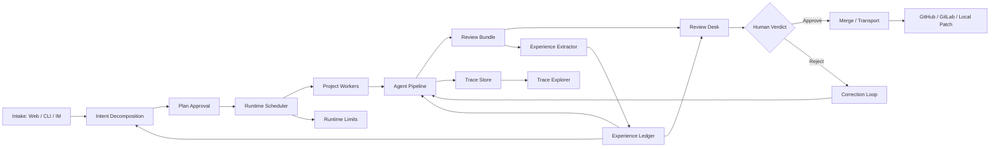

# CPB 完整产品规划

日期：2026-06-02

本文定义 CodePatchbay 面向一人公司的一体化工程运营产品形态。它不是对 Closed-Loop MVP 的简单扩写，而是把 CPB 从“能跑任务的流水线”推进为“能承接需求、调度并发、审计交付、沉淀经验、连接外部通道的工程中枢”。

## 产品定位

CPB 是一人公司的工程运营系统。

用户不需要直接管理每个 agent 的执行细节。用户负责表达意图、批准计划、审阅结果和做最终合入判断。CPB 负责拆解、执行、纠偏、记录、复盘和跨项目调度。

## 完整愿景

完整产品要支持以下闭环：

1. 用户通过 Web、CLI 或 IM 提交需求。
2. CPB 自动拆解意图，形成计划和风险说明。
3. 用户批准或拒绝计划。
4. CPB 将计划发送给真实流水线执行。
5. 流水线自动纠偏，必要时重试、换 agent、请求人工审批。
6. CPB 生成 Review Bundle，并可选择发布为 GitHub/GitLab PR。
7. agent 在用户审阅前生成审阅总结和批准/拒绝建议。
8. 用户批准则合入，拒绝则附带意见。
9. CPB 读取用户意见和 agent 缺陷总结，重新执行 correction loop。
10. 多个项目可以同时运行，用户可以在一个审计台里处理不同项目的请求。
11. 系统架构、运行状态、工具调用、文件修改和经验沉淀都可见。

## 产品原则

1. **真实优先**：不把 fake 验证当作产品能力。
2. **人类最终控制权**：计划、拒绝、合入都由用户最终决定。
3. **GitHub 可选**：Review Bundle 是核心，GitHub/GitLab 是 transport。
4. **并发是能力**：不能靠降低并发伪装稳定。
5. **运行时可调**：项目上限和 provider 上限必须在线调整。
6. **全链路可审计**：工具调用、文件修改、agent 决策都要可追溯。
7. **经验可治理**：经验要有来源、置信度、作用域和失效条件。
8. **一人公司友好**：减少用户切换上下文，让用户只处理真正需要判断的事。

## 当前成熟度判断

当前系统已经具备：

1. hub queue 和 project worker 骨架。
2. review session 骨架。
3. append-only event store。
4. agent config 合并机制。
5. ACP pool。
6. channel adapter 雏形。
7. experience extractor 雏形。
8. Web dashboard 基础。

当前主要缺口：

1. 非 GitHub closed-loop 还不完整。
2. reject 后没有真正 correction loop。
3. 动态并发控制还不是运行时控制面。
4. trace 还不到每次工具调用和每次文件修改。
5. experience 还没有进入 planning/execution/review。
6. IM 还不是完整操作台。
7. 多项目审计体验不够产品化。
8. browser-agent 需要单独真实验证后再上主链路。

粗略成熟度：

| 阶段 | 成熟度 |
|---|---|
| 当前 | 约 30% |
| Closed-Loop MVP 完成后 | 约 55% 到 60% |
| Product Alpha 完成后 | 约 75% |
| Product Beta 完成后 | 约 90% |
| 1.0 完整产品 | 约 100% |

## 完整架构

## 产品模块

### 1. Founder Inbox

用户提交、筛选、优先级排序所有需求的地方。它不是普通 task list，而是“我这个一人公司现在要让系统推进什么”的入口。

核心能力：

1. Web/CLI/IM 提交需求。
2. 选择项目、优先级、约束和期望交付方式。
3. 显示等待计划批准、等待审阅、运行中、失败待处理。
4. 支持多项目并行视图。

### 2. Planning Desk

CPB 拆解需求并给出计划。用户在这里决定是否让流水线开始执行。

核心能力：

1. 意图拆解。
2. 风险和边界说明。
3. agent/route 建议。
4. 计划审批。
5. 计划拒绝和重新规划。
6. 相关经验自动引用。

### 3. Runtime Control Plane

运行时调度和并发治理。它负责在线调整项目上限和 provider 上限。

核心能力：

1. 项目并发上限。
2. providerMax。
3. 无 ACP global total。
4. 上限调整不重启。
5. 下调不杀 active。
6. over-capacity 状态可见。
7. 每次调整留审计事件。

### 4. Pipeline Runtime

真实执行计划的流水线。

核心能力：

1. plan/execute/verify/review/correction phase。
2. agent preflight。
3. provider handoff。
4. retry/backoff。
5. protected operation approval。
6. worktree isolation。
7. local finalization。

### 5. Review Bundle

CPB 的核心交付物。GitHub PR、GitLab MR、local patch 都只是 Review Bundle 的发布方式。

核心能力：

1. request summary。
2. approved plan。
3. changed files。
4. diff。
5. test results。
6. agent review summary。
7. approve/reject recommendation。
8. trace link。
9. correction round history。

### 6. Review Desk

用户审阅交付的地方。

核心能力：

1. 多项目 review queue。
2. agent 预审总结。
3. diff 和测试结果。
4. approve/reject。
5. reject comments。
6. correction round 对比。
7. local merge 或 transport publish。

### 7. Trace Explorer

让系统执行过程可见。

核心能力：

1. job timeline。
2. phase timeline。
3. agent/provider handoff。
4. tool call started/completed。
5. file modified events。
6. diff snapshot。
7. retry/correction cause。
8. secret redaction。

### 8. Experience Ledger

项目和用户偏好的组织记忆。

核心能力：

1. 从失败、拒绝、批准、人工裁决中提取经验。
2. 经验有 source、confidence、scope、status、invalidates。
3. 经验候选需要人类批准才能变 durable rule。
4. planning/execution/review 自动检索相关经验。
5. 经验冲突检测和过期机制。

### 9. Channel Gateway

IM 和外部通道不是通知系统，而是轻量操作台。

核心能力：

1. 提交需求。
2. 收计划摘要。
3. 批准或拒绝计划。
4. 查看状态。
5. 收 Review Bundle 摘要。
6. approve/reject 并附带意见。
7. 查看日志。
8. 取消或重试任务。

### 10. Transport Layer

把 Review Bundle 发布到外部系统。

核心能力：

1. Local Review Bundle。
2. GitHub PR。
3. GitLab MR。
4. patch file。
5. branch/worktree handoff。
6. transport failure 不影响本地审阅能力。

## 分期路线

从当前状态到完整产品，预计总量约 115 到 130 人天。其中 Closed-Loop MVP 约 39 人天，后续完整产品化约 80 到 95 人天。

### Phase 0: Closed-Loop MVP，39 人天

详见 `docs/product/cpb-closed-loop-mvp-plan.md`。

完成后系统具备：

1. 无 GitHub closed-loop。
2. Local Review Bundle。
3. reject correction loop。
4. 动态项目上限和 providerMax。
5. 真实并发验证。
6. 最小 trace。

### Phase 1: 多项目审计工作台，10 人天

| ID | 1 人天任务 | 交付物 | 验收 |
|---|---|---|---|
| P1-1 | Founder Inbox 信息架构 | Inbox 状态模型和 UI 草图 | 状态覆盖 plan/review/running/failed |
| P1-2 | 多项目 request list | Web 页面按项目、状态、优先级显示请求 | 可同时看到多个项目待处理项 |
| P1-3 | Attention Queue | 汇总需要用户决策的计划、审阅、失败 | 用户不用进入每个项目找待办 |
| P1-4 | Project switcher | 项目切换和过滤 | 大于 5 个项目时仍可快速定位 |
| P1-5 | Request detail page | 单个 request 的 plan、job、bundle、rounds 汇总 | 一个页面看完整生命周期 |
| P1-6 | Review queue view | 多项目 Review Bundle 列表 | 支持 approve/reject/analyze |
| P1-7 | Failure queue view | 失败任务按 failure kind 分组 | 用户能快速判断是 provider、contract、timeout 还是 verify |
| P1-8 | Dashboard API 扩展 | API 返回 attention counts 和 project health | UI 不做客户端拼接猜测 |
| P1-9 | 前端状态类型完善 | `web/src/types/api.ts` 等类型覆盖新字段 | 类型不再丢失 queue/bundle/limit 信息 |
| P1-10 | 工作台验收测试 | Web/API 测试 | 多项目数据展示稳定 |

### Phase 2: 完整 Trace Explorer，12 人天

| ID | 1 人天任务 | 交付物 | 验收 |
|---|---|---|---|
| P2-1 | tool call event schema | `tool_call_started/completed` schema | 事件包含 tool、phase、agent、duration、status |
| P2-2 | ACP tool hook | ACP client 或 adapter 层记录工具调用 | 每次真实工具调用都有 trace |
| P2-3 | file change event schema | `file_modified`、`diff_snapshot` | 能表达新增、修改、删除、rename |
| P2-4 | phase diff attribution | phase 前后 diff 归因 | 知道哪个 phase 改了哪些文件 |
| P2-5 | tool arg redaction | secret redaction 规则 | token/path secret 不泄漏 |
| P2-6 | trace materializer | 从 events 生成 timeline view model | API 不直接暴露原始 JSONL |
| P2-7 | trace API | `GET /jobs/:id/trace` | 支持分页和按类型过滤 |
| P2-8 | Trace Explorer UI | timeline、tool calls、diff snapshots | 用户可视化追踪 job 执行 |
| P2-9 | failure root view | 从失败跳到相关 phase/tool/diff | failed job 不再只显示错误字符串 |
| P2-10 | trace export | 导出 trace markdown/json | 可附到 Review Bundle |
| P2-11 | trace 测试集 | event order/redaction/materialize 测试 | trace 稳定且不泄密 |
| P2-12 | trace 性能检查 | 大 job 事件读取性能 | 长 timeline 不拖慢 dashboard |

### Phase 3: Experience Ledger v1，12 人天

| ID | 1 人天任务 | 交付物 | 验收 |
|---|---|---|---|
| P3-1 | ledger schema | 结构化经验条目 | source/confidence/scope/status/createdFrom |
| P3-2 | candidate store | 经验候选池 | 自动提取先进入 candidate |
| P3-3 | approval flow | 人类批准 durable rule | 未批准经验不注入长期 prompt |
| P3-4 | reject feedback extraction | 从用户拒绝意见提取经验 | 拒绝原因可变成候选规则 |
| P3-5 | failure lesson extraction | 从失败和修复中提取经验 | failure kind 绑定经验 |
| P3-6 | approval lesson extraction | 从批准和成功交付提取模式 | 成功模式也能沉淀 |
| P3-7 | relevance search | 按项目、文件、任务类型检索经验 | planning 前能找到相关经验 |
| P3-8 | planning injection | 计划阶段引用相关经验 | plan 标明引用了哪些经验 |
| P3-9 | execution injection | 执行阶段引用工程约束 | agent 能看到项目硬约束 |
| P3-10 | review injection | 审阅阶段引用历史拒绝/缺陷 | agent review 更贴近用户偏好 |
| P3-11 | conflict/expiry | 经验冲突和过期机制 | 旧经验不永久污染系统 |
| P3-12 | ledger UI | 查看、批准、禁用、删除经验 | 用户能治理组织记忆 |

### Phase 4: Channel Gateway，10 人天

| ID | 1 人天任务 | 交付物 | 验收 |
|---|---|---|---|
| P4-1 | channel command contract | 统一 submit/status/approve/reject/logs 语义 | Slack/Discord 等不各写业务逻辑 |
| P4-2 | actor mapping | channel user 到 CPB actor | 审计事件有真实 actor |
| P4-3 | IM submit request | 从 IM 创建 request/review session | 返回计划生成状态 |
| P4-4 | IM plan approval | IM 批准/拒绝计划 | 写入 approval event |
| P4-5 | IM status summary | 按 request/job 查询状态 | 状态可读且短 |
| P4-6 | IM review bundle summary | 推送 Review Bundle 摘要 | 含 recommendation 和主要 diff |
| P4-7 | IM reject comments | IM 拒绝并附意见 | 触发 correction loop |
| P4-8 | IM logs command | 返回最近 trace/log 摘要 | 不泄漏 secret |
| P4-9 | channel permission policy | 限制谁可 approve/merge/cancel | 未授权 actor 被拒绝 |
| P4-10 | channel integration tests | Slack/Discord 路由和签名测试 | 通道操作稳定 |

### Phase 5: Transport Layer，8 人天

| ID | 1 人天任务 | 交付物 | 验收 |
|---|---|---|---|
| P5-1 | transport interface | Review Bundle transport 抽象 | local/github/gitlab/patch 共用接口 |
| P5-2 | local patch transport | 生成 patch file 和 branch handoff | 无远端也能交付 |
| P5-3 | GitHub PR transport | 从 Review Bundle 创建 PR | GitHub 失败不影响本地 bundle |
| P5-4 | GitLab MR transport | 从 Review Bundle 创建 MR | GitLab 可选 |
| P5-5 | transport status model | pending/published/failed/retryable | UI 能展示发布状态 |
| P5-6 | transport retry | 发布失败可重试 | 不重复创建冲突 PR/MR |
| P5-7 | transport audit | 发布动作写事件 | 可追溯谁发布到哪里 |
| P5-8 | transport tests | local/GitHub/GitLab 接口测试 | transport failure 有清晰错误 |

### Phase 6: Browser Agent 独立验证和 UI Lane，8 人天

| ID | 1 人天任务 | 交付物 | 验收 |
|---|---|---|---|
| P6-1 | browser-agent readiness check | Playwright/browser provider 真实检查 | 缺浏览器时明确不可用 |
| P6-2 | UI lane routing policy | 只有明确 UI/browser 任务才进入 browser lane | 主流水线不会误触发 browser-agent |
| P6-3 | browser task suite | 真实 UI 任务测试集 | 不用 fake browser |
| P6-4 | browser trace events | 记录导航、点击、截图、失败 | UI 任务可审计 |
| P6-5 | screenshot artifact bundle | 截图进入 Review Bundle | 用户能看 UI 验证证据 |
| P6-6 | browser failure handling | browser unavailable/timeout 分类 | 失败不污染普通 agent pipeline |
| P6-7 | UI lane config | 项目级启用/禁用 browser lane | 默认关闭或按能力启用 |
| P6-8 | browser lane 验收 | 真实浏览器任务跑通 | 通过后才允许进入主产品 |

### Phase 7: Agent 和 Provider 治理，10 人天

| ID | 1 人天任务 | 交付物 | 验收 |
|---|---|---|---|
| P7-1 | agent profile registry | planner/executor/verifier/reviewer profile | 不再靠散落 metadata 猜 agent |
| P7-2 | variant validation | 阻止 `variant:none` 等无效配置 | enqueue 前能发现错误 |
| P7-3 | provider health dashboard | provider availability/backoff/latency | 用户知道为什么任务排队 |
| P7-4 | providerMax per provider | 每个 provider 独立上限 | 运行时可调 |
| P7-5 | route policy UI | 项目级 agent/profile 设置 | 不改文件也能调整 |
| P7-6 | capability matrix | agent 支持的角色、工具、稳定性 | routing 有依据 |
| P7-7 | contract validation hardening | agent output schema 校验和恢复 | `contract_invalid` 有可修复路径 |
| P7-8 | provider fallback policy | provider handoff 策略 | 不盲目 retry 同一失败 provider |
| P7-9 | cost and latency tracking | provider 成本/耗时统计 | 用户可看到运营成本 |
| P7-10 | provider governance tests | 配置、上限、fallback 测试 | 治理能力稳定 |

### Phase 8: 策略、权限和安全，10 人天

| ID | 1 人天任务 | 交付物 | 验收 |
|---|---|---|---|
| P8-1 | actor model | user/channel/agent/system actor | 所有动作有主体 |
| P8-2 | operation policy | write/shell/network/push/PR/merge 策略 | 高风险操作必须审批 |
| P8-3 | project permissions | 项目级权限 | 用户可限制某些项目只读 |
| P8-4 | approval policy UI | 配置哪些操作需要批准 | 策略可见可改 |
| P8-5 | secret redaction audit | trace/bundle/channel 全部 redaction | secret 不出现在 UI/IM |
| P8-6 | protected path policy | 敏感路径强制升级 review | 修改 protected 文件触发人工审批 |
| P8-7 | merge guard | 合入前检查状态、测试、审批 | 未审阅不能合入 |
| P8-8 | audit log browser | 查看所有审批/拒绝/合入/limit 修改 | 适合复盘 |
| P8-9 | policy tests | 权限和审批测试 | 未授权操作失败 |
| P8-10 | security review runbook | 安全验收文档 | 1.0 前可重复执行 |

### Phase 9: 质量评估系统，8 人天

| ID | 1 人天任务 | 交付物 | 验收 |
|---|---|---|---|
| P9-1 | real task benchmark set | 真实小任务集合 | 不用 fake agent 成功作为指标 |
| P9-2 | closed-loop benchmark | 测量 submit 到 bundle 的成功率 | 有历史趋势 |
| P9-3 | reject-loop benchmark | 测量拒绝后修正成功率 | correction loop 可量化 |
| P9-4 | concurrency benchmark | 多项目和 providerMax 验证 | 并发不退化 |
| P9-5 | trace completeness metric | 每个 job 的 trace 完整度 | 缺事件可报警 |
| P9-6 | bundle quality rubric | Review Bundle 完整度评分 | bundle 不只是有文件 |
| P9-7 | agent recommendation accuracy | agent approve/reject 建议与用户最终决定对比 | 预审质量可持续提升 |
| P9-8 | quality dashboard | 成功率、失败类、成本、耗时 | 运营状态可见 |

### Phase 10: UX 和产品完成度，10 人天

| ID | 1 人天任务 | 交付物 | 验收 |
|---|---|---|---|
| P10-1 | 信息架构整理 | Inbox/Planning/Runtime/Review/Trace/Ledger 导航 | 用户知道去哪处理什么 |
| P10-2 | request creation UX | 提交需求表单和项目选择 | 新任务不需要记 CLI 参数 |
| P10-3 | approval UX | 计划批准/拒绝体验 | 审批原因可留痕 |
| P10-4 | review UX | diff、summary、tests、recommendation 布局 | 审阅效率高 |
| P10-5 | correction UX | 多轮对比和拒绝意见输入 | 用户能看出修了什么 |
| P10-6 | runtime limits UX | 动态上限控制面板 | 调整清楚且有风险提示 |
| P10-7 | provider health UX | provider 状态、backoff、队列 | 运行问题可见 |
| P10-8 | trace UX | timeline 可筛选、可折叠 | 长 job 不混乱 |
| P10-9 | empty/error states | 空状态、失败状态、loading | 产品不像内部工具半成品 |
| P10-10 | responsive polish | 桌面和窄屏可用 | 一人公司移动审阅场景可用 |

### Phase 11: 运维、恢复和打包，8 人天

| ID | 1 人天任务 | 交付物 | 验收 |
|---|---|---|---|
| P11-1 | install/doctor hardening | 安装检查和修复建议 | 新环境能快速定位问题 |
| P11-2 | hub lifecycle UX | start/stop/status/restart 指南 | 运行状态清楚 |
| P11-3 | worker recovery | worker crash 后恢复策略 | 不留僵尸 running |
| P11-4 | queue reconciliation UI | stale jobs/leases 可视化处理 | 不只靠 CLI |
| P11-5 | backup/export | bundle/ledger/trace 导出 | 数据可迁移 |
| P11-6 | data retention | events/trace/artifact 保留策略 | 长期运行不会无限膨胀 |
| P11-7 | versioned migrations | schema 迁移 | 升级不破坏旧数据 |
| P11-8 | release checklist | 1.0 发布验收清单 | 每次发布有固定门槛 |

## 完整产品完成标准

1. 用户可以从 Web、CLI 或 IM 提交需求。
2. CPB 可以跨多个项目并行处理请求。
3. 每个请求都有计划审批、执行、审阅、拒绝修正、最终批准链路。
4. 无 GitHub 时本地 Review Bundle 仍可用。
5. GitHub/GitLab/local patch 都只是 transport。
6. 项目并发和 providerMax 可以运行时调整。
7. ACP 不设全局总上限。
8. 每个 job 的工具调用、文件修改、provider handoff、失败原因可追溯。
9. 经验系统进入 planning/execution/review，并可由用户治理。
10. IM 可以完成提交、审批、审阅、拒绝、状态查询。
11. browser-agent 只在独立真实验证通过后进入 UI lane。
12. 失败率、成本、耗时、trace 完整度都有 dashboard。
13. 所有高风险操作有权限、审批和审计。

## 距离完整愿景

从当前状态估算：

| 阶段 | 人天 | 目标 |
|---|---:|---|
| Closed-Loop MVP | 39 | 证明真实无 GitHub 闭环 |
| Product Alpha | 30 到 35 | 多项目审计、完整 trace、IM 基础 |
| Product Beta | 35 到 45 | Experience Ledger、transport、provider governance |
| Product 1.0 | 30 到 40 | 安全、UX、browser lane、质量评估、运维 |

总计约 115 到 130 人天。

如果单人连续推进，日历时间约 5 到 7 个月。若使用 CPB 自己的 agent 流水线并行推进，且每个阶段坚持真实验收，日历时间可能压到 2.5 到 4 个月，但不能通过 fake 验收压缩。

## 最重要的执行顺序

1. 先完成 Closed-Loop MVP。
2. 再做多项目审计和 Trace Explorer。
3. 再把 Experience Ledger 接入 planning/execution/review。
4. 再产品化 IM 和 external transports。
5. 最后补 browser lane、安全治理、质量评估和发布运维。

原因很简单：如果 closed-loop 不真实稳定，后面的体验和通道都会变成包装。如果 trace 不够，experience ledger 会没有可信来源。如果权限和审计太晚补，1.0 就无法安全发布。
