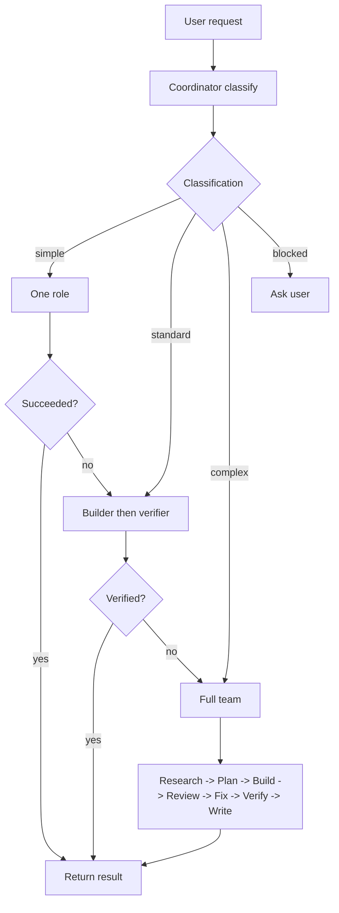

# Flow Team Profile Architecture

> Architecture for a profile-driven Flow team that uses ACP as the transport layer and wiki/state as shared memory.

## Status

- **State**: Draft
- **Owner**: Flow Coordinator
- **Updated**: 2026-05-13

## Design Principles

1. **Role first, provider second**: `builder` is a role; Claude Code, z.ai, OllamaCloud, and Xiaomi are runtime/model choices.
2. **Coordinator is the only entry router**: every user-facing task starts with lightweight classification and workflow selection.
3. **Use the lightest safe workflow**: simple tasks should not pay full-team overhead.
4. **Profiles are contracts**: identity, permissions, memory, and skills live with the role.
5. **Secrets stay outside profiles**: configs reference env names; real values come from ignored secret files or shell env.
6. **ACP is the adapter boundary**: Flow should not depend on provider-specific prompt hacks where ACP can carry the interaction.
7. **Wiki is for handoff evidence**: project state and agent communication stay inspectable and durable.
8. **Worktrees isolate writers**: code-writing tasks use per-task git worktrees; the primary project directory is the integration target.
9. **Coordinator does not do the work**: it classifies complexity, selects workflow, and chooses roles/variants; execution belongs to the selected roles.

## Current Baseline

Flow currently has this shape:

```text
flow CLI
  -> bridges/codex-plan.sh
  -> bridges/claude-execute.sh
  -> bridges/codex-verify.sh
  -> bridges/acp-client.mjs
  -> codex-acp / claude-agent-acp
  -> wiki/projects/{project}/inbox|outputs
```

Existing profiles:

```text
profiles/codex/soul.md
profiles/claude/soul.md
```

Target architecture generalizes those provider profiles into role profiles.

## Target Module Map

```text
flow CLI / Web UI
  -> coordinator classifier
  -> workflow planner
  -> profile loader
  -> ACP launcher
  -> agent runtime
  -> wiki/state store
```

### Responsibilities

| Module | Responsibility |
| --- | --- |
| CLI/UI | Accept task input, show status, let user choose optional role variants. |
| Coordinator classifier | Decide `simple`, `standard`, `complex`, or `blocked` without launching the team by default. |
| Workflow planner | Expand classification into ordered phases and roles. |
| Profile loader | Load `soul.md`, `user.md`, `memory.md`, `config.yaml`, `skills/`, and selected variant. |
| ACP launcher | Start the runtime with cwd, env overlay, and permission envelope. |
| ACP client | Speak JSON-RPC over stdio and enforce filesystem/terminal policy. |
| Wiki/state store | Persist classification, plans, handoffs, verdicts, logs, and task state. |

## Directory Layout

```text
profiles/
  coordinator/
    soul.md
    user.md
    memory.md
    config.yaml
    env.schema
    skills/
  researcher/
  planner/
  builder/
    variants/
      glm5.1.yaml
      kimi-k2.6.yaml
      mimo-v2.5pro.yaml
  reviewer/
  verifier/
  writer/
  security/
```

Global team docs stay under:

```text
wiki/system/
  team-prd.md
  team-architecture.md
  memory-routing.md
  skill-registry.md
  handshake-protocol.md
```

Project task state should live under:

```text
wiki/projects/{project}/
  tasks.md
  tasks/{task-id}/classification.yaml
  inbox/
  outputs/
  log.md
  project.json
```

Machine state can continue under:

```text
flow-task/state/
flow-task/worktrees/{project}/{task-id}/
flow-task/events/{project}/{task-id}.jsonl
```

## Profile Schema

`config.yaml` should describe role defaults, not secrets.

```yaml
role: builder
runtime: claude-code-acp
default_variant: kimi-k2.6

cwd:
  default: project

permissions:
  fs:
    read:
      - project
      - flow_project_wiki
      - flow_system_readonly
    write:
      - project
      - flow_project_outputs
  terminal:
    allow: true
    policy: project_only
  forbidden:
    - flow_profiles
    - flow_bridges
    - flow_system_write
    - secrets

handoff:
  reads:
    - inbox/plan-*.md
    - inbox/review-*.md
  writes:
    - outputs/deliverable-*.md
    - outputs/test-report-*.md
```

Variant files provide runtime-specific env overlays:

```yaml
variant: kimi-k2.6
provider: ollamacloud
model: kimi-k2.6
env:
  ANTHROPIC_BASE_URL: ${OLLAMACLOUD_BASE_URL}
  ANTHROPIC_AUTH_TOKEN: ${OLLAMACLOUD_API_KEY}
  ANTHROPIC_MODEL: kimi-k2.6
```

Flow resolves `${NAME}` from the process environment or ignored secret files. The resolved values are injected only into the child ACP process for that invocation.

## Task Classification

Every user-facing request enters through this fixed gate:

```text
request
  -> coordinator classify
  -> simple | standard | complex | blocked
  -> workflow selection
```

This gate is intentionally cheap. It may inspect the request text, project metadata, existing task state, and explicit user constraints. It should not run research, make code changes, or spawn the full team.

The coordinator emits a small record before dispatch:

```yaml
task_id: task-001
classification: standard
confidence: high
workflow: builder_then_verifier
roles:
  - builder
  - verifier
risk: low
needs_user_input: false
variant_overrides:
  builder: kimi-k2.6
reasons:
  - clear_acceptance_criteria
  - code_change_expected
```

Canonical storage:

```text
wiki/projects/{project}/tasks/{task-id}/classification.yaml
```

The wiki record keeps the routing decision inspectable. A JSON mirror under `flow-task/state/` is optional and should be treated as a cache for UI and automation, not the source of truth.

### Classification Dimensions

| Dimension | Simple signal | Complex signal |
| --- | --- | --- |
| File scope | 1-3 files | Multi-module or multi-directory |
| Requirements | Clear | Fuzzy or needs clarification |
| Risk | Low and reversible | Permission, data, architecture, or security impact |
| Verification | One command proves it | Multiple tests, review, or repeated cycles |
| Dependencies | No new dependency | New dependency, service, or protocol |
| Duration | Short task | Long-running or multi-round |
| Handoff | Not needed | Researcher, planner, reviewer, or writer needed |
| State | No durable memory needed | Wiki/state tracking required |

## Workflow Selection



### Simple

```text
coordinator -> selected role -> light verification -> result
```

### Standard

```text
coordinator -> builder -> verifier -> result
```

### Complex

```text
coordinator
  -> researcher
  -> planner
  -> builder
  -> reviewer
  -> builder fix loop
  -> verifier
  -> writer
```

### Blocked

```text
coordinator -> user
```

Only use `blocked` when the missing decision is truly material, destructive, externally visible, or credential-gated.

### Escalation

```text
simple fails once -> standard
standard verification fails once -> complex
multi-module/security/architecture impact discovered -> complex
missing requirements/credentials/destructive authority -> blocked
```

## Worktree Concurrency Model

Flow should treat git worktrees as the default answer to concurrent code-writing.

```text
primary project directory
  -> integration target

Flow managed task worktrees
  -> flow-task/worktrees/{project}/{task-id}/
```

### Policy

| Operation | Workspace |
| --- | --- |
| Read-only scan, explanation, classification | Primary project directory |
| Planning | Primary project directory + Flow wiki |
| Building code | Task worktree |
| Reviewing implementation | Same task worktree |
| Verifying implementation | Same task worktree |
| Writing docs tied to implementation | Same task worktree |
| Merging accepted work | Primary project directory under merge lock |

This gives Flow true parallel builders without mixing code states.

### Non-Git Project Bootstrap

If the target project is not a git repository, Flow should initialize git by default before running code-writing workflows.

```text
1. Detect git repository:
   git -C <project> rev-parse --is-inside-work-tree

2. If not a repository:
   git -C <project> init

3. Ensure safe ignore coverage:
   respect existing .gitignore
   add common local ignore patterns when needed

4. If repository has no commits:
   create a protected local baseline commit

5. Create task branch and worktree:
   branch: flow/{project}/{task-id}-{slug}
   path:   flow-task/worktrees/{project}/{task-id}-{slug}
```

`git worktree` needs an existing commit to branch from. That is why `git init` must be paired with a protected baseline commit when the project has no history.

### Protected Baseline Commit

The baseline commit should stage only safe project files. It must exclude:

- `.env`, `.env.*`, credentials, keys, tokens, and secret files;
- dependency directories such as `node_modules/`;
- build outputs such as `dist/`, `build/`, `target/`, and coverage output;
- Flow runtime state such as `flow-task/state/`, `.omx/state/`, and managed worktrees;
- large cache directories.

If Flow detects likely secrets that would be staged, it should stop with `blocked` and explain the file paths that need ignore rules. Flow should never push the baseline commit to a remote.

### Locks Still Needed

Worktrees remove most write collisions, but not every shared resource.

| Lock | Purpose |
| --- | --- |
| `worktree-registry.lock` | Prevent duplicate branch/path allocation. |
| `artifact.lock` | Prevent wiki artifact ID collisions. |
| `merge.lock` | Ensure accepted task branches merge into the primary project one at a time. |
| `provider semaphore` | Limit concurrent calls to the same model/provider. |
| `resource.lock` | Protect shared ports, databases, caches, and local services. |

### Merge Flow

```text
1. Verifier returns PASS for the task worktree.
2. Coordinator acquires merge.lock.
3. Flow checks primary project is clean or safely mergeable.
4. Flow merges task branch into the primary project.
5. Flow runs configured post-merge verification.
6. Flow releases merge.lock.
7. Flow prunes or archives the task worktree.
```

Merge conflicts should return to the builder or reviewer with the conflict evidence. They should not be auto-resolved silently.

## Runtime Launch Flow

```text
1. Coordinator chooses role and optional variant.
2. Workflow planner chooses primary project cwd or task worktree cwd.
3. Profile loader reads role files.
4. Profile loader merges config.yaml with variants/{variant}.yaml.
5. Secret resolver expands env references from safe sources.
6. Permission compiler converts profile permissions into ACP policy.
7. Prompt builder assembles role context and task context.
8. ACP launcher starts codex-acp or claude-agent-acp.
9. ACP client enforces path and terminal policy.
10. Agent writes handoff outputs.
11. Flow updates wiki and machine state.
```

## ACP Permission Model

The ACP client should enforce policy locally even if prompts also contain constraints.

### Filesystem

Allowed roots should be derived from profile permissions:

| Symbol | Resolves To |
| --- | --- |
| `project` | The active workspace for the phase: primary project for read-only phases, task worktree for write phases. |
| `project_source` | `wiki/projects/{project}/project.json.sourcePath` |
| `project_worktree` | The task-specific worktree path for code-writing phases. |
| `flow_project_wiki` | `wiki/projects/{project}/` |
| `flow_project_outputs` | `wiki/projects/{project}/outputs/` |
| `flow_system_readonly` | selected files under `wiki/system/` |
| `flow_profiles_readonly` | selected role profile files |

Writes must reject paths outside allowed write roots. Reads must reject secrets and unrelated projects.

### Terminal

Terminal access should be phase-aware:

| Role | Terminal Default |
| --- | --- |
| `coordinator` | deny |
| `researcher` | deny by default, allow read-only commands if configured |
| `planner` | deny |
| `builder` | allow in project cwd |
| `reviewer` | deny by default |
| `verifier` | allow configured verification commands or deny in strict mode |
| `writer` | deny |
| `security` | allow read-only inspection commands if configured |

### Permission Requests

`session/request_permission` should not default to broad allow. The response should be derived from:

1. role profile,
2. phase,
3. requested tool,
4. requested path or command,
5. dangerous mode flag.

## Provider and Variant Selection

The provider matrix should be role-aware:

| Role | Default Runtime | Suggested Variants |
| --- | --- | --- |
| `coordinator` | Codex ACP | Codex default |
| `researcher` | Claude Code ACP | `kimi-k2.6`, `glm5.1` |
| `planner` | Codex ACP | Codex default |
| `builder` | Claude Code ACP | `glm5.1`, `kimi-k2.6`, `mimo-v2.5pro` |
| `reviewer` | Codex ACP | Codex default |
| `verifier` | Codex ACP | Codex default |
| `writer` | Claude Code ACP | `kimi-k2.6`, `glm5.1` |
| `security` | Codex ACP | Codex default |

The CLI can expose overrides later:

```bash
flow run my-project "implement login" --builder kimi-k2.6
flow run my-project "scan codebase" --researcher glm5.1
```

## Handoff Evolution

Current handoff types remain valid:

```text
plan-{id}.md
deliverable-{id}.md
verdict-{id}.md
review-{id}.md
test-report-{id}.md
```

New team handoffs should add:

```text
research-{id}.md
doc-update-{id}.md
security-review-{id}.md
```

Coordinator classifications are task records, not inbox handoffs:

```text
wiki/projects/{project}/tasks/{task-id}/classification.yaml
```

The existing `handshake-protocol.md` should evolve from `codex | claude` sender names to role names:

```text
coordinator | researcher | planner | builder | reviewer | verifier | writer | security
```

## Failure and Escalation

| Failure | Response |
| --- | --- |
| Simple role fails | Upgrade to standard. |
| Builder produces no deliverable | Retry once, then complex workflow. |
| Verifier returns `FAIL` | Send verdict to builder fix loop. |
| Repeated `FAIL` | Escalate to reviewer/planner for revised plan. |
| Permission denied | Coordinator decides whether to ask user or adjust workflow. |
| Missing secret | Block and ask user for credential setup. |
| Agent inactivity | ACP idle timeout can stop the invocation. Active progress should not count as timeout. |

## Migration Plan

### Phase 1: Documentation and Schema

- Add PRD and architecture docs.
- Define profile file layout and role set.
- Update README and wiki lint references.

### Phase 2: Profile Scaffolding

- Add role directories with `soul.md`, `user.md`, `memory.md`, `config.yaml`, `env.schema`.
- Keep existing `profiles/codex` and `profiles/claude` as compatibility aliases.
- Add variant files for `glm5.1`, `kimi-k2.6`, and `mimo-v2.5pro`.

### Phase 3: Runtime Loader

- Implement profile loader.
- Implement variant/env overlay resolver.
- Implement role-aware `acp_run`.
- Persist classification records.

### Phase 4: Worktree Manager

- Detect whether a target project is a git repository.
- Run `git init` by default for non-git projects.
- Create protected baseline commits when no commits exist.
- Create task branches and task worktrees under `flow-task/worktrees/`.
- Add merge locking and post-merge verification hooks.

### Phase 5: Workflow Engine

- Add coordinator classification command.
- Add simple, standard, complex, and blocked workflows.
- Write `wiki/projects/{project}/tasks/{task-id}/classification.yaml` before dispatch.
- Add escalation logic.
- Update UI to show workflow and role phase.

### Phase 6: Safety Hardening

- Enforce filesystem roots in ACP client.
- Enforce terminal policy.
- Make permission requests role-aware.
- Add profile lint and tests.

## Implementation Risks

- Provider env variables may differ across Claude Code compatible vendors.
- Profile configs can drift if there is no validator.
- Prompt constraints alone are not sufficient for sandboxing.
- Complex workflow can become too slow if the coordinator over-classifies tasks.
- Compatibility aliases must avoid silently changing existing pipeline behavior.
- Automatic git initialization can accidentally capture secrets unless baseline staging is conservative.
- Worktree merge conflicts still require explicit repair and verification.

## Acceptance Criteria

- Role, runtime, provider, and variant are clearly separated.
- The coordinator has a defined classification contract.
- The coordinator classification step is lightweight and does not start a full team by default.
- Simple, standard, complex, and blocked workflows are specified.
- Profile config describes permissions without storing secrets.
- ACP launch flow explains where env overlays and permission checks happen.
- Code-writing tasks use per-task worktrees by default.
- Non-git projects are initialized with git before worktree-based writing begins.
- Migration can be implemented incrementally without breaking current `flow plan`, `flow execute`, `flow verify`, and `flow pipeline`.
